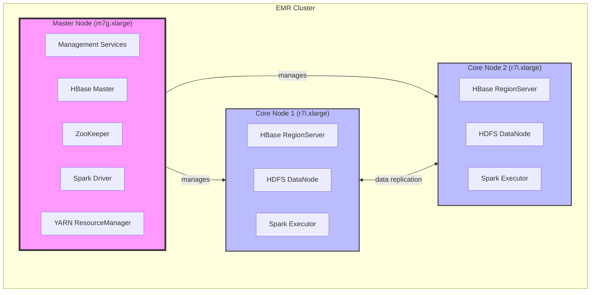
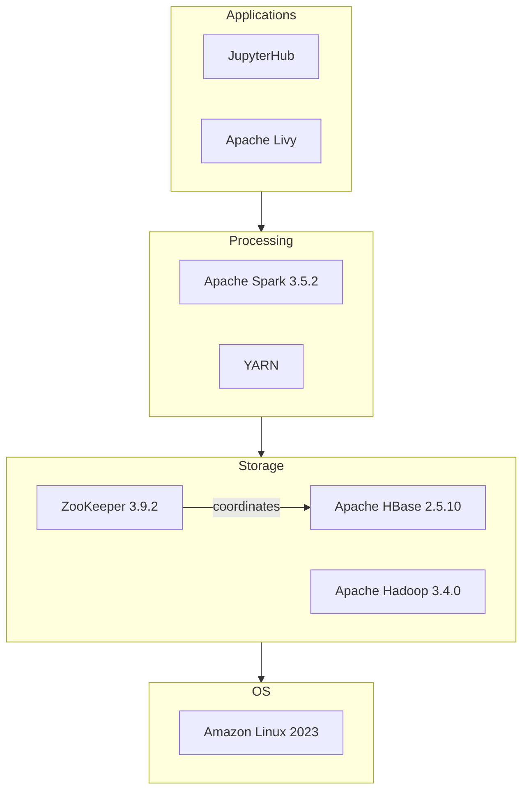
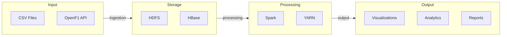
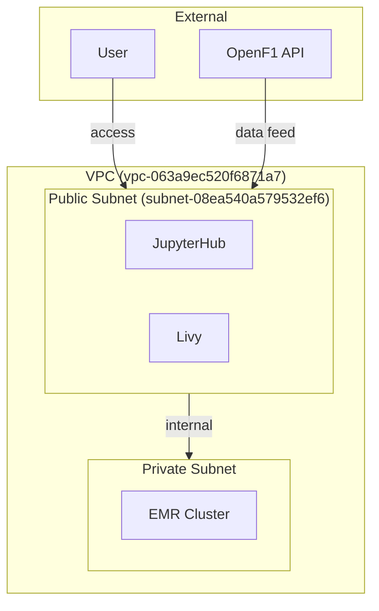
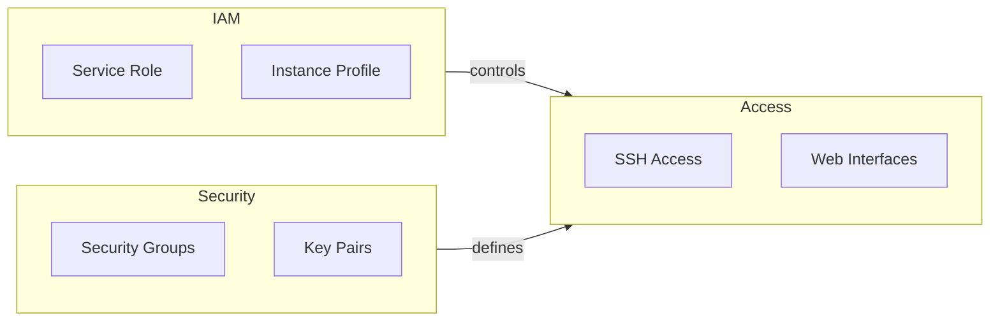

# EMR Cluster Architecture Documentation

## 1. Overview

This document provides a detailed architectural overview of the 3-node Amazon EMR cluster designed for Formula 1 data analysis. The system leverages Apache HBase for distributed data storage and Apache Spark for high-performance data processing. The architecture is optimized to handle large volumes of telemetry data, race statistics, and driver performance metrics, providing a robust platform for in-depth analysis of Formula 1 races.

The cluster is specifically designed to meet the requirements of the ECE Paris Big Data course project, demonstrating a practical application of distributed systems in a real-world scenario. It also serves as a foundational component of a larger web application for Formula 1 data analysis, showcasing the integration of various AWS services.

## 2. Cluster Architecture

### 2.1. Physical Infrastructure

The cluster comprises one master node and two core nodes, utilizing specific EC2 instance types chosen for their performance characteristics and suitability for the intended workloads.

#### Diagram: Cluster Node Distribution



#### Node Specifications:

##### Master Node (m7g.xlarge)

-   **Instance Type**: `m7g.xlarge`
-   **Compute**: 4 vCPU, 16 GB RAM
-   **Storage**: 50 GB EBS gp3 volume
-   **Roles**:
    -   Cluster management and coordination
    -   HBase Master
    -   YARN ResourceManager
    -   Spark Driver
    -   ZooKeeper

The `m7g.xlarge` instance type was selected for the master node due to its balanced compute and memory resources, which are essential for handling cluster management tasks and coordinating the distributed services.

##### Core Nodes (2x r7i.xlarge)

-   **Instance Type**: `r7i.xlarge`
-   **Compute**: 4 vCPU, 32 GB RAM each
-   **Storage**: 150 GB EBS gp3 volume each
-   **Roles**:
    -   HBase RegionServers
    -   HDFS DataNodes
    -   YARN NodeManagers
    -   Spark Executors

The `r7i.xlarge` instance type was chosen for the core nodes to provide ample memory for HBase RegionServers and Spark Executors, ensuring efficient data storage and processing. The larger EBS gp3 volumes accommodate the HDFS data, with the replication factor set to 2 for data redundancy across the two core nodes.

### 2.2. Design Considerations

The selection of instance types and storage configurations was driven by several factors:

-   **Performance Requirements**: The need for fast data ingestion, efficient query processing, and real-time analytics capabilities.
-   **Scalability**: The ability to scale the cluster based on future data growth and processing demands.
-   **Cost Optimization**: Balancing performance needs with cost-effectiveness, especially considering the project's context as a course assignment.
-   **Integration**: Seamless integration with other AWS services used in the broader web application for Formula 1 data analysis.

The initial consideration of using `t3.small/medium` instances was discarded in favor of `r7i.xlarge` for core nodes to ensure sufficient memory for HBase and Spark operations. The choice of `m7g.xlarge` for the master node was made to handle cluster management tasks efficiently without incurring excessive costs.

## 3. Software Architecture

### 3.1. Component Stack

The software stack comprises several key open-source distributed systems, each playing a crucial role in the data processing pipeline.

#### Diagram: Software Component Interactions



#### Component Details:

-   **Apache Hadoop 3.4.0**: Provides the distributed file system (HDFS) and resource management (YARN) for the cluster.
-   **Apache HBase 2.5.10**: A NoSQL, distributed database built on top of HDFS, providing real-time read/write access to large datasets.
-   **Apache Spark 3.5.2**: A unified analytics engine for large-scale data processing, used for data analysis and transformation tasks.
-   **Apache ZooKeeper 3.9.2**: A centralized service for maintaining configuration information, naming, providing distributed synchronization, and providing group services.
-   **JupyterHub 1.5.0**: Enables multi-user access to Jupyter notebooks for interactive data analysis and visualization.
-   **Apache Livy 0.8.0**: A REST interface for interacting with Spark, simplifying the submission of Spark jobs from applications.
-   **Amazon Linux 2023**: The operating system for all nodes in the cluster, providing a stable and secure environment.

### 3.2. Data Flow Architecture

The data flow architecture illustrates how data is ingested, processed, and consumed within the system.

#### Diagram: Data Flow Through the System



#### Data Flow Stages:

1. **Input**: Data is sourced from the OpenF1 API and potentially from CSV files. The OpenF1 API provides real-time and historical Formula 1 data, including telemetry, timing, and race control messages.
2. **Storage**:
    -   **HDFS**: Raw data and intermediate results are stored in HDFS.
    -   **HBase**: Structured data, optimized for fast access, is stored in HBase tables. The row key design is optimized for time-series data: `{year}#{meeting_key}#{session_key}#{driver_number}#{timestamp}`.
3. **Processing**:
    -   **Spark**: Data processing tasks, including data transformation, aggregation, and analysis, are performed using Spark. Spark reads data from both HDFS and HBase.
    -   **YARN**: Resource management and job scheduling for Spark applications are handled by YARN.
4. **Output**: Processed data and analysis results are made available through various outputs:
    -   **Visualizations**: Jupyter notebooks hosted on JupyterHub provide interactive visualizations.
    -   **Analytics**: Spark jobs generate analytical results, which can be stored back in HBase or exported as CSV files.
    -   **Reports**: Comprehensive reports are generated based on the analysis results.

## 4. Network Architecture

### 4.1. Network Configuration

The cluster is deployed within a specific AWS region and utilizes a designated VPC and subnet.

-   **Region**: `eu-west-3` (Paris)
-   **VPC ID**: `vpc-063a9ec520f6871a7`
-   **Subnet**: `subnet-08ea540a579532ef6`

#### Diagram: Network Flow and Access Points



#### Network Flow Description:

1. **External Access**:
    -   Users interact with the cluster through web interfaces hosted in the public subnet, such as JupyterHub and Livy.
    -   The OpenF1 API provides data to the cluster, also accessed through the public subnet.
2. **Internal Communication**:
    -   Communication between the cluster nodes occurs within the private subnet for security and performance reasons.
    -   The public subnet acts as a gateway for external access to services running on the cluster.

### 4.2. Subnet Selection Rationale

The choice of `subnet-08ea540a579532ef6` within the `eu-west-3a` Availability Zone was made to:

-   Ensure all nodes reside within the same Availability Zone, minimizing inter-node latency.
-   Facilitate efficient communication between the cluster nodes and other AWS services used by the broader web application.
-   Simplify network configuration and security group management.

## 5. Security Architecture

### 5.1. Access Control

Security is managed through a combination of IAM roles, security groups, and access control mechanisms.

#### Diagram: Security Components and Access Control



#### Security Components:

-   **IAM Roles**:
    -   **Service Role**: `AmazonEMR-ServiceRole-20241219T204718` - Grants EMR the necessary permissions to manage resources on your behalf.
    -   **Instance Profile**: `AmazonEMR-InstanceProfile-20241219T204701` - Provides EC2 instances within the cluster with the permissions to access other AWS services.

-   **Access Methods**:
    -   **SSH**: Secure shell access to the master node is enabled via the "PolePredict Cluster" key pair. This allows for direct command-line interaction with the cluster.
    -   **Web Interfaces**:
        -   **JupyterHub**: `https://<master-node>:9443` - Provides a secure, multi-user environment for running Jupyter notebooks.
        -   **HBase UI**: `http://<master-node>:16010` - Offers a web-based interface for monitoring and managing the HBase cluster.
        -   **Spark History**: `http://<master-node>:18080` - Allows for the monitoring of completed Spark applications.

-   **Security Groups**: Security groups act as virtual firewalls, controlling inbound and outbound traffic to the cluster nodes. Proper configuration of security groups is crucial for securing the cluster and allowing necessary access.

-   **Key Pairs**: The "PolePredict Cluster" key pair is used to authenticate SSH access to the master node, ensuring secure remote management.

### 5.2. Security Considerations

-   The initial setup faced challenges with IAM role permissions, particularly regarding EC2 security group creation. These were resolved by adding the necessary permissions to the `AmazonEMR-ServiceRole-20241219T204718` role.
-   Proper configuration of security groups was essential to enable SSH access and allow access to web interfaces.
-   The use of a dedicated key pair ("PolePredict Cluster") enhances the security of SSH access.
-   Network access is restricted to the specified subnet, limiting exposure to potential threats.

## 6. Resource Management

### 6.1. YARN Configuration

YARN (Yet Another Resource Negotiator) plays a critical role in managing resources within the cluster.

#### Diagram: YARN Resource Management

```mermaid
graph TB
    subgraph YARN["YARN Resource Management"]
        RM[Resource Manager\n(Master Node)]
        NM1[Node Manager 1\n(Core Node 1)]
        NM2[Node Manager 2\n(Core Node 2)]
    end

    subgraph Resources
        MEM[Memory]
        CPU[CPU]
        DISK[Storage]
    end

    RM --> |allocates| NM1
    RM --> |allocates| NM2
    NM1 --> |manages| Resources
    NM2 --> |manages| Resources
```

#### Resource Allocation:

-   **Executor Configuration**:
    -   **Memory**: 4GB per executor - Provides sufficient memory for Spark tasks.
    -   **Cores**: 2 per executor - Allows for concurrent execution of tasks within each executor.
-   **Dynamic Allocation**:
    -   **Enabled**: Allows Spark to dynamically adjust the number of executors based on workload demands.
    -   **Scaling**: Scales between 2 and 6 executors, providing flexibility to handle varying processing needs.

### 6.2. Resource Management Rationale

-   The YARN configuration is designed to optimize resource utilization across the cluster, ensuring that Spark jobs have access to sufficient resources while preventing resource contention.
-   Dynamic allocation enables efficient use of resources, particularly for workloads that vary over time.
-   The memory and core settings per executor are tailored to the `r7i.xlarge` instance type, maximizing performance without overallocating resources.

## 7. Conclusion

This architecture document provides a comprehensive overview of the EMR cluster's design, implementation, and configuration. The choices made in terms of instance types, storage, software components, and security configurations were driven by the specific requirements of the Formula 1 data analysis project, aiming to create a robust, scalable, and cost-effective platform for data processing and analysis. The architecture also takes into consideration the broader context of the project, including its integration with a larger web application and its role as an educational tool for the ECE Paris Big Data course.