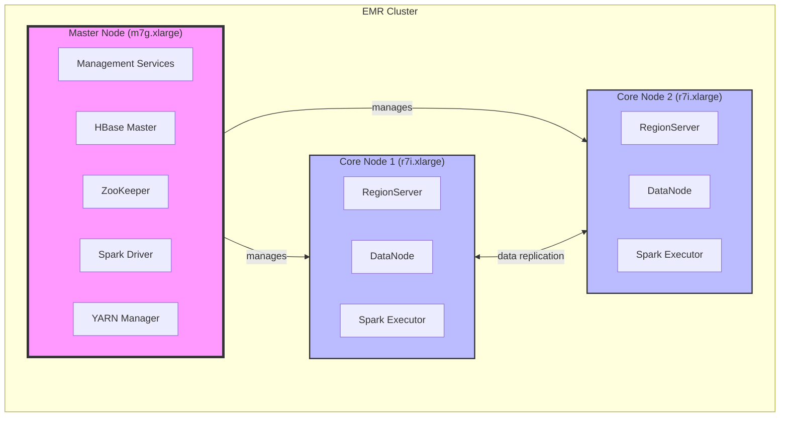
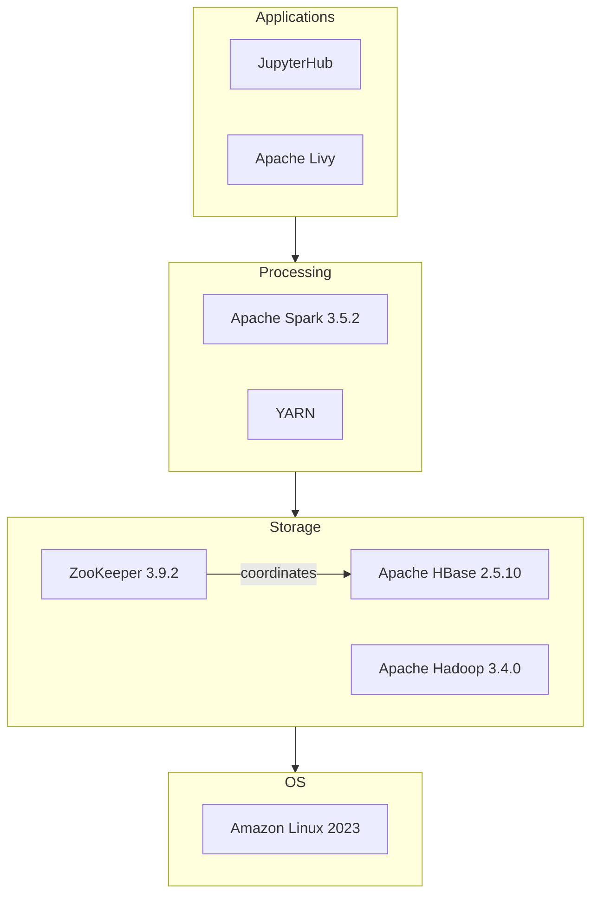
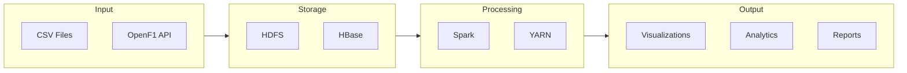
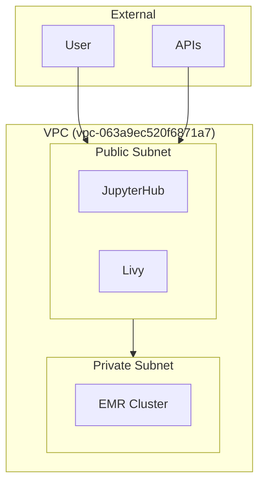
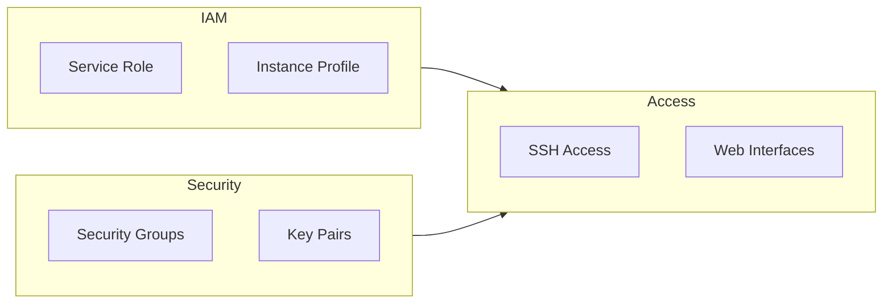
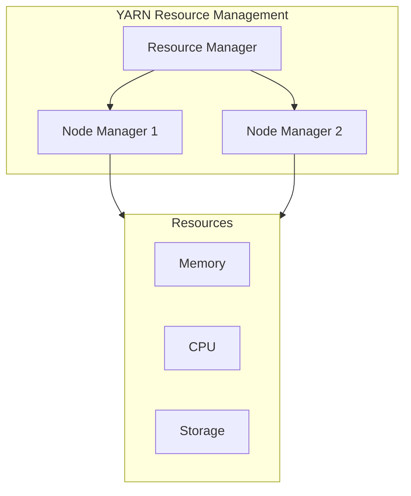

# EMR Cluster Architecture Documentation

## Overview
This document details the architecture of our 3-node Amazon EMR cluster, designed for high-performance distributed data storage and processing using HBase and Spark. The architecture is optimized for Formula 1 data analysis, providing robust storage capabilities and efficient data processing.

## Cluster Architecture

### Physical Infrastructure
The following diagram illustrates the cluster's physical architecture and node distribution:

### Node Specifications

#### Master Node (m7g.xlarge)
- **Compute**: 4 vCPU, 16 GB RAM
- **Storage**: 50 GB EBS gp3
- **Services**:
  - Cluster management
  - HBase Master
  - YARN ResourceManager
  - Spark Driver
  - ZooKeeper

#### Core Nodes (2x r7i.xlarge)
- **Compute**: 4 vCPU, 32 GB RAM each
- **Storage**: 150 GB EBS gp3 each
- **Services**:
  - HBase RegionServers
  - HDFS DataNodes
  - YARN NodeManagers
  - Spark Executors

## Software Architecture

### Component Stack
The following diagram shows the software stack and component interactions:

### Data Flow Architecture
The following diagram illustrates the data flow through the system:

## Network Architecture

### Network Configuration
- **Region**: eu-west-3 (Paris)
- **VPC ID**: vpc-063a9ec520f6871a7
- **Subnet**: subnet-08ea540a579532ef6

### Network Flow

## Security Architecture

### Access Control

### Security Components
- **IAM Roles**:
  - Service Role: AmazonEMR-ServiceRole-20241219T204718
  - Instance Profile: AmazonEMR-InstanceProfile-20241219T204701
- **Access Methods**:
  - SSH via "PolePredict Cluster" key pair
  - Web interfaces:
    - JupyterHub: `https://<master-node>:9443`
    - HBase UI: `http://<master-node>:16010`
    - Spark History: `http://<master-node>:18080`

## Resource Management

### YARN Configuration

### Resource Allocation
- **Executor Configuration**:
  - Memory: 4GB per executor
  - Cores: 2 per executor
- **Dynamic Allocation**:
  - Enabled for automatic scaling
  - Based on workload demands
