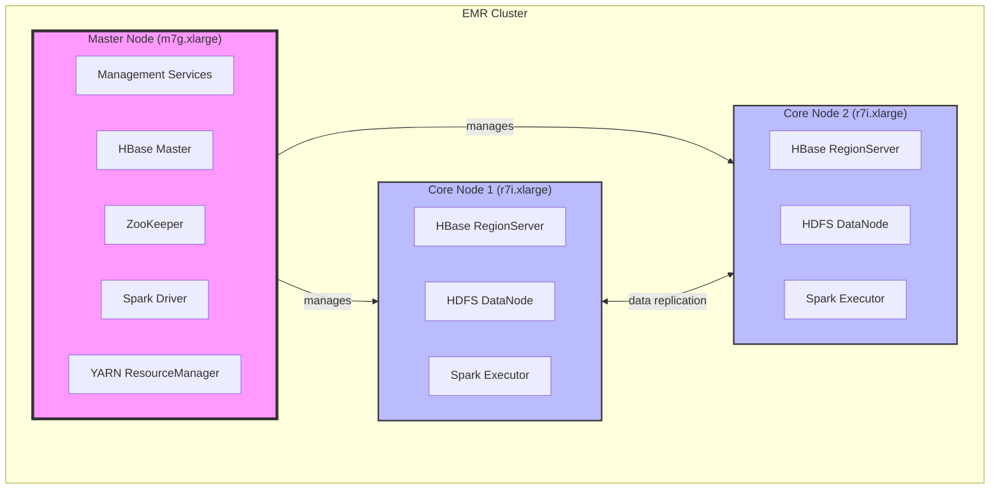
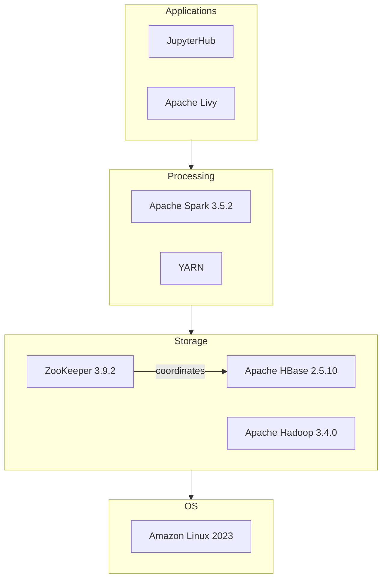
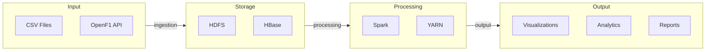
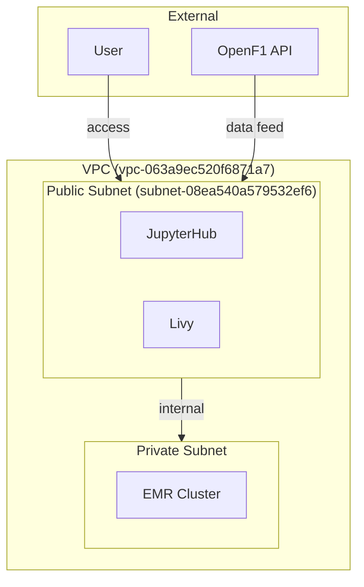
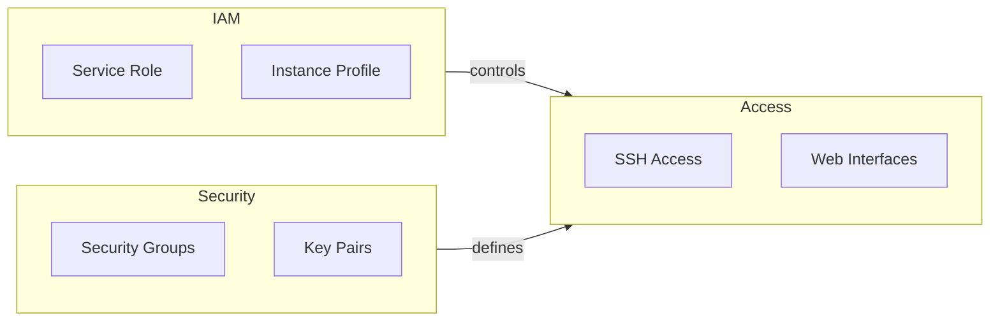
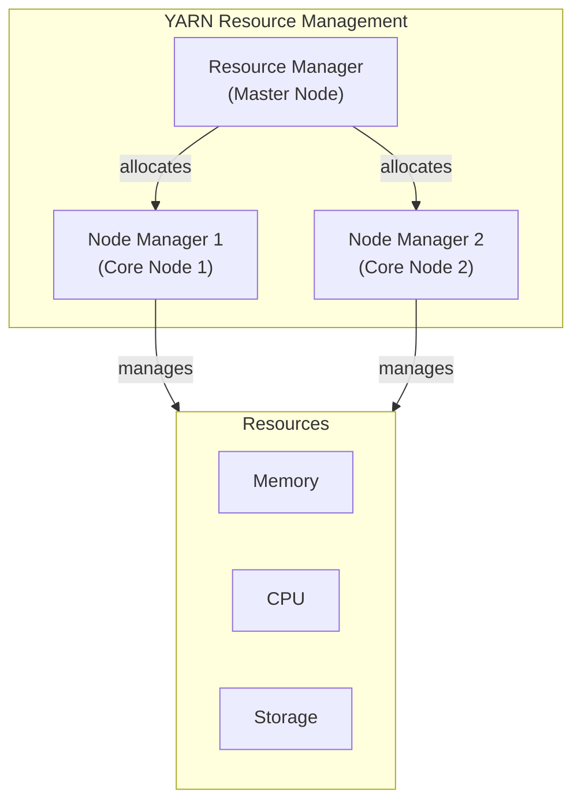

## EMR Cluster Architecture for Formula 1 Data Analysis

This document outlines the architecture of a 3-node Amazon EMR cluster designed for Formula 1 data analysis using Apache HBase and Spark. It's built for the ECE Paris Big Data course project and forms a base for a larger web application.

## Cluster Architecture

This cluster consists of one master node and two core nodes.

**Cluster Node Distribution:**

**Node Specifications:**

| Node Type   | Instance Type | vCPU | RAM (GB) | Storage (GB gp3) | Roles                                                                                             |
|-------------|---------------|------|----------|------------------|-------------------------------------------------------------------------------------------------|
| Master      | `m7g.xlarge`  | 4    | 16       | 50               | Cluster management, HBase Master, YARN ResourceManager, Spark Driver, ZooKeeper                  |
| Core (x2) | `r7i.xlarge`  | 4    | 32       | 150              | HBase RegionServer, HDFS DataNode, YARN NodeManager, Spark Executor (per core node)             |

**Design Considerations:**

*   **Performance:** Optimized for fast data processing and querying.
*   **Scalability:** Designed to handle future data growth.
*   **Cost:** Balancing performance with cost-effectiveness for a course project.
*   **Integration:** Designed for integration with other AWS services.

The choice of `r7i.xlarge` for core nodes prioritizes memory for HBase and Spark operations, improving efficiency compared to initial considerations of `t3.small/medium`. `m7g.xlarge` for the master node balances management needs and cost.

## Software Architecture

The cluster utilizes a stack of open-source distributed systems.

**Software Component Interactions:**

**Component Details:**

| Component         | Version    | Role                                                                                               |
|-----------------|------------|---------------------------------------------------------------------------------------------------|
| Apache Hadoop     | 3.4.0      | Distributed file system (HDFS) and resource management (YARN).                                     |
| Apache HBase      | 2.5.10     | NoSQL distributed database for real-time read/write access.                                        |
| Apache Spark      | 3.5.2      | Unified analytics engine for large-scale data processing.                                          |
| Apache ZooKeeper  | 3.9.2      | Centralized service for configuration, synchronization, and group services for distributed systems. |
| JupyterHub        | 1.5.0      | Multi-user access to Jupyter notebooks.                                                            |
| Apache Livy       | 0.8.0      | REST interface for interacting with Spark.                                                        |
| Amazon Linux      | 2023       | Operating system for all nodes.                                                                   |

**Data Flow Through the System:**

Data flows from the OpenF1 API and CSV files into HDFS for raw data and HBase for structured data. Spark processes data using YARN for resource management. Processed data is outputted as visualizations, analytics, and reports. HBase's row key is structured as `{year}#{meeting_key}#{session_key}#{driver_number}#{timestamp}` for time-series optimization.

## Network Architecture

The cluster resides within a specific AWS region, VPC, and subnet.

**Network Flow and Access Points:**

**Network Configuration:**

*   **Region:** `eu-west-3` (Paris)
*   **VPC ID:** `vpc-063a9ec520f6871a7`
*   **Subnet:** `subnet-08ea540a579532ef6`

The subnet choice (`subnet-08ea540a579532ef6` in `eu-west-3a`) ensures low latency by keeping all nodes in the same Availability Zone and simplifies network management. External access to JupyterHub and Livy occurs via the public subnet, while internal cluster communication remains within the private subnet.

## Security Architecture

Security is managed through IAM roles, security groups, and access controls.

**Security Components and Access Control:**

*   **IAM Roles:**
    *   **Service Role:** `AmazonEMR-ServiceRole-20241219T204718` (EMR permissions)
    *   **Instance Profile:** `AmazonEMR-InstanceProfile-20241219T204701` (EC2 instance permissions)
*   **Access Methods:**
    *   **SSH:** Enabled via "PolePredict Cluster" key pair.
    *   **Web Interfaces:**
        *   JupyterHub: `https://<master-node>:9443`
        *   HBase UI: `http://<master-node>:16010`
        *   Spark History: `http://<master-node>:18080`
*   **Security Groups:** Control inbound/outbound traffic.
*   **Key Pairs:** "PolePredict Cluster" for secure SSH access.

**Security Considerations:** Initial IAM permission issues were resolved by adjusting the service role. Security groups are critical for controlling access, and a dedicated key pair secures SSH. Network access is restricted to the specified subnet.

## Resource Management

YARN manages cluster resources.

**YARN Resource Management:**

**Resource Allocation:**

| Parameter           | Value | Description                                                        |
|---------------------|-------|--------------------------------------------------------------------|
| Executor Memory     | 4GB   | Memory allocated to each Spark executor.                           |
| Executor Cores      | 2     | Number of cores allocated to each Spark executor.                  |
| Dynamic Allocation  | Enabled (2-6 executors) | Spark dynamically adjusts the number of executors based on workload. |

The YARN configuration optimizes resource usage, preventing contention and ensuring efficient Spark job execution. Dynamic allocation helps adapt to varying workloads. Executor settings are tailored to the `r7i.xlarge` instance type.

## Conclusion

This EMR cluster architecture is designed to be robust, scalable, and cost-effective for Formula 1 data analysis. The choices in hardware, software, and security are tailored to the project's needs and its integration within a larger application.
