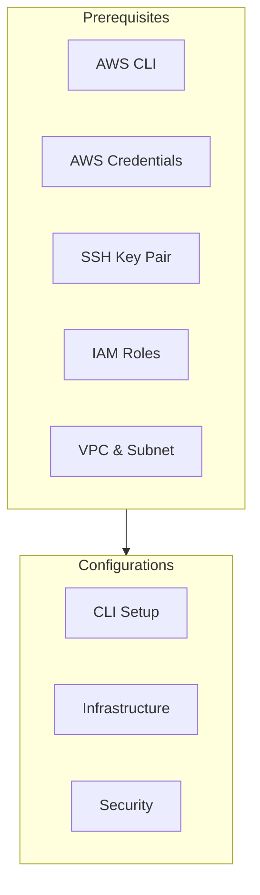

# EMR Cluster Installation Guide for F1 Data Analytics Platform

## 1. Introduction

This guide provides comprehensive, step-by-step instructions for setting up an Amazon EMR cluster configured with HBase and Spark for Formula 1 data analysis. The cluster consists of one master node and two core nodes, running on Amazon Linux 2023, and is designed to handle large-scale data processing and storage for F1 telemetry data, race statistics, and performance metrics.

This guide covers all necessary steps, from initial AWS setup to cluster creation, configuration, access, and verification. It also addresses common issues and provides troubleshooting tips.

## 2. Prerequisites

Before you begin, ensure you have the following prerequisites in place:

### 2.1. Required Components



-   **AWS CLI**: Installed and configured with appropriate permissions.
-   **AWS Credentials**: An IAM user with programmatic access and permissions to create and manage EMR clusters, EC2 instances, security groups, and IAM roles.
-   **SSH Key Pair**: An SSH key pair named "PolePredict Cluster" created in the `eu-west-3` (Paris) region.
-   **IAM Roles**: The following IAM roles configured:
    -   **Service Role**: `AmazonEMR-ServiceRole-20241219T204718`
    -   **Instance Profile**: `AmazonEMR-InstanceProfile-20241219T204701`
-   **VPC and Subnet**: A VPC (`vpc-063a9ec520f6871a7`) and subnet (`subnet-08ea540a579532ef6`) configured in the `eu-west-3` region.

### 2.2. Skill Requirements

-   Basic familiarity with the AWS Management Console.
-   Understanding of core AWS services, including EC2, EMR, IAM, VPC, and security groups.
-   Basic Linux command-line skills.
-   Experience with SSH for remote server access.

## 3. Installation Steps

### 3.1. AWS CLI Configuration

#### 3.1.1. Installation

If the AWS CLI is not already installed, follow these steps:

```bash
# Update the package list
sudo apt-get update

# Install the AWS CLI
sudo apt-get install awscli -y

# Verify the installation
aws --version
```

#### 3.1.2. Configuration

Configure the AWS CLI with your credentials:

```bash
aws configure
```

You will be prompted to enter:

-   **AWS Access Key ID**: Your IAM user's access key ID.
-   **AWS Secret Access Key**: Your IAM user's secret access key.
-   **Default region name**: `eu-west-3`
-   **Default output format**: `json`

This command creates the credentials file (`~/.aws/credentials`) and the configuration file (`~/.aws/config`) with your settings.

### 3.2. Infrastructure Verification

Before creating the EMR cluster, verify the existence and configuration of your AWS infrastructure components:

#### 3.2.1. VPC Configuration

```bash
# List all VPCs
aws ec2 describe-vpcs

# Verify the specific VPC ID
aws ec2 describe-vpcs --vpc-ids vpc-063a9ec520f6871a7
```

#### 3.2.2. Subnet Configuration

```bash
# List all subnets
aws ec2 describe-subnets

# Verify the specific subnet ID
aws ec2 describe-subnets --subnet-ids subnet-08ea540a579532ef6
```

#### 3.2.3. IAM Roles

```bash
# List all IAM roles
aws iam list-roles

# Check for the required EMR roles
aws iam list-roles | grep -E "EMR|emr"

# Verify the specific service role
aws iam get-role --role-name AmazonEMR-ServiceRole-20241219T204718

# Verify the specific instance profile
aws iam get-instance-profile --instance-profile-name AmazonEMR-InstanceProfile-20241219T204701
```

**Important Note:** Ensure that the `AmazonEMR-ServiceRole-20241219T204718` role has the necessary permissions to create security groups. If it lacks these permissions, you'll need to add them through the IAM console. Refer to the "Problems and Solutions" document (`problems.md`) for detailed instructions on adding these permissions.

### 3.3. Cluster Creation

#### 3.3.1. Script Creation

Create a shell script named `create_cluster.sh` with the following content:

```bash
#!/bin/bash

CLUSTER_NAME="BigData-HBase-Spark"
REGION="eu-west-3"
EMR_VERSION="emr-7.5.0"
LOG_URI="s3://aws-logs-891376966635-eu-west-3/elasticmapreduce"
SERVICE_ROLE="arn:aws:iam::891376966635:role/service-role/AmazonEMR-ServiceRole-20241219T204718"
SUBNET_ID="subnet-08ea540a579532ef6"

aws emr create-cluster \
  --name "${CLUSTER_NAME}" \
  --release-label "${EMR_VERSION}" \
  --region "${REGION}" \
  --log-uri "${LOG_URI}" \
  --service-role "${SERVICE_ROLE}" \
  --applications Name=Hadoop Name=HBase Name=Spark Name=ZooKeeper Name=JupyterHub Name=Livy \
  --unhealthy-node-replacement \
  --tags 'for-use-with-amazon-emr-managed-policies=true' \
  --ec2-attributes "{
    \"InstanceProfile\":\"AmazonEMR-InstanceProfile-20241219T204701\",
    \"SubnetId\":\"${SUBNET_ID}\",
    \"KeyName\":\"PolePredict Cluster\"
  }" \
  --instance-groups "[
    {
      \"InstanceCount\":1,
      \"InstanceGroupType\":\"MASTER\",
      \"Name\":\"Primary\",
      \"InstanceType\":\"m7g.xlarge\",
      \"EbsConfiguration\":{
        \"EbsBlockDeviceConfigs\":[
          {
            \"VolumeSpecification\":{
              \"VolumeType\":\"gp3\",
              \"SizeInGB\":50
            },
            \"VolumesPerInstance\":1
          }
        ]
      }
    },
    {
      \"InstanceCount\":2,
      \"InstanceGroupType\":\"CORE\",
      \"Name\":\"Core\",
      \"InstanceType\":\"r7i.xlarge\",
      \"EbsConfiguration\":{
        \"EbsBlockDeviceConfigs\":[
          {
            \"VolumeSpecification\":{
              \"VolumeType\":\"gp3\",
              \"SizeInGB\":150
            },
            \"VolumesPerInstance\":1
          }
        ]
      }
    }
  ]" \
  --scale-down-behavior "TERMINATE_AT_TASK_COMPLETION" \
  --ebs-root-volume-size "50"
```

**Explanation of Parameters:**

-   `--name`: Specifies the name of the EMR cluster.
-   `--release-label`: Defines the EMR release version (7.5.0 includes Hadoop 3.4.0, HBase 2.5.10, Spark 3.5.2, ZooKeeper 3.9.2, JupyterHub 1.5.0 and Livy 0.8.0).
-   `--applications`: Lists the applications to be installed on the cluster.
-   `--region`: Specifies the AWS region for the cluster.
-   `--service-role`: Assigns the IAM service role for EMR.
-   `--ec2-attributes`: Configures EC2 instance attributes, including the instance profile, subnet ID, and SSH key pair name.
-   `--instance-groups`: Defines the instance groups for the master and core nodes, including instance types, instance counts, and EBS storage configurations.
-   `--log-uri`: Sets the S3 bucket for storing EMR logs.
-   `--auto-scaling-role`: Specifies the IAM role for automatic scaling (optional but recommended).
-   `--ebs-root-volume-size`: Sets the size of the root EBS volume.
-   `--scale-down-behavior`: Determines how instances are terminated during scale-down operations.
-   `--profile`: The AWS CLI profile to use for creating the cluster (if you have multiple profiles configured).

#### 3.3.2. Script Execution

Make the script executable and run it:

```bash
chmod +x create_cluster.sh
./create_cluster.sh
```

This command will create the EMR cluster according to the specified configuration. The output will provide the cluster ID upon successful initiation.

After execution, you should see your cluster in the EMR console:


### 3.4. Cluster Verification

After launching the cluster, monitor its creation and verify its status:

#### 3.4.1. Get Cluster Status

Use the `describe-cluster` command with the cluster ID to get detailed information about the cluster:

```bash
aws emr describe-cluster --cluster-id <your-cluster-id>
```

Replace `<your-cluster-id>` with the actual cluster ID returned by the `create-cluster` command.

#### 3.4.2. List Active Clusters

To list all active clusters in your account:

```bash
aws emr list-clusters --active
```

#### 3.4.3. Monitor Cluster State

Pay close attention to the `Status` field in the `describe-cluster` output. The `State` will transition through various stages:

-   **STARTING**: The cluster is being provisioned.
-   **BOOTSTRAPPING**: The instances are being prepared.
-   **RUNNING**: The cluster is running and ready for use.
-   **WAITING**: The cluster is running and waiting for steps (if any were submitted).
-   **TERMINATING**: The cluster is in the process of shutting down.
-   **TERMINATED**: The cluster has been shut down.
-   **TERMINATED\_WITH\_ERRORS**: The cluster terminated with errors.

Current cluster configuration:


### 3.5. Access Configuration

#### 3.5.1. SSH Access Setup

1. **Get the Master Node DNS**:

    ```bash
    aws emr describe-cluster --cluster-id <your-cluster-id> \
        --query 'Cluster.MasterPublicDnsName'
    ```

    This command retrieves the public DNS name of the master node, which you'll need for SSH access.

2. **Configure Security Group Access**:

    By default, the security group associated with the master node may not allow inbound SSH traffic. You need to authorize inbound SSH access (port 22) from your IP address.

    ```bash
    # Get the security group ID for the master node
    aws emr describe-cluster --cluster-id <your-cluster-id> \
        --query 'Cluster.Ec2InstanceAttributes.EmrManagedMasterSecurityGroup'

    # Authorize inbound SSH traffic from any IP address (use with caution)
    aws ec2 authorize-security-group-ingress \
        --group-id <security-group-id> \
        --protocol tcp \
        --port 22 \
        --cidr 0.0.0.0/0
    ```

    **Important Security Note:** Allowing SSH access from `0.0.0.0/0` is generally not recommended for production environments. It's more secure to restrict access to your specific IP address or a known range of IP addresses. You can find your public IP address using services like `curl ifconfig.me`.

    Replace `<security-group-id>` with the actual security group ID retrieved from the previous command.

#### 3.5.2. SSH Key Setup

**For WSL Users:**

Due to permission issues with Windows-mounted directories in WSL, you need to copy the key file to your WSL home directory and set the appropriate permissions:

```bash
# Copy the key file to your WSL home directory
cp "/mnt/c/path/to/PolePredict Cluster.pem" ~/

# Change directory to your WSL home
cd ~

# Set the correct permissions on the key file
chmod 400 "PolePredict Cluster.pem"

# Connect to the cluster using the key from your WSL home
ssh -i "PolePredict Cluster.pem" hadoop@<master-public-dns>
```

**For Non-WSL Users:**

```bash
# Set the correct permissions on the key file
chmod 400 "PolePredict Cluster.pem"

# Connect to the cluster
ssh -i "PolePredict Cluster.pem" hadoop@<master-public-dns>
```

Replace `<master-public-dns>` with the actual public DNS name of the master node.

Successful connection should show:


### 3.6. Web Interface Access

Once the cluster is running, you can access the following web interfaces through the master node's public DNS:

```mermaid
graph LR
    subgraph Web Interfaces
        JH[JupyterHub\n9443]
        HB[HBase UI\n16010]
        SP[Spark History\n18080]
    end

    DNS[Master Node DNS] --> Web Interfaces
```

-   **JupyterHub**: `https://<master-node-dns>:9443`
-   **HBase UI**: `http://<master-node-dns>:16010`
-   **Spark History Server**: `http://<master-node-dns>:18080`

**Note:** It may take 15-20 minutes after the cluster enters the `RUNNING` state for all web interfaces to become fully available.

## 4. Cluster Details

-   **Cluster ID**:  (e.g., j-LE8CLNR85COH - This will be unique to your cluster)
-   **EMR Version**: `emr-7.5.0`
-   **Applications**: Hadoop 3.4.0, HBase 2.5.10, Spark 3.5.2, ZooKeeper 3.9.2, JupyterHub 1.5.0, Livy 0.8.0
-   **OS**: Amazon Linux 2023

## 5. Troubleshooting

If you encounter issues during the installation process, refer to the `problems.md` document for detailed troubleshooting steps. Here are some common issues and their solutions:

-   **Instance Type Availability**: If the specified instance types (`m7g.xlarge` or `r7i.xlarge`) are not available in the `eu-west-3` region, you may need to choose alternative instance types. Refer to `problems.md` for guidance on selecting appropriate alternatives.
-   **SSH Connection Problems**: If you cannot connect to the master node via SSH, verify the security group settings, key pair permissions, and network connectivity. Refer to `problems.md` for detailed troubleshooting steps.
-   **Web Interface Inaccessibility**: If the web interfaces are not accessible, ensure that the cluster is fully initialized (it can take 15-20 minutes) and that the necessary ports (9443, 16010, 18080) are open in the security group.
-   **IAM Role Permissions**: If you encounter permission errors during cluster creation, ensure that the `AmazonEMR-ServiceRole-20241219T204718` role has sufficient permissions, particularly for creating security groups. Refer to `problems.md` for instructions on adding the required permissions.

## 6. Conclusion

This guide provides a comprehensive walkthrough of the installation and configuration process for the EMR cluster. By following these steps, you should have a fully functional EMR cluster with HBase and Spark, ready for Formula 1 data analysis. Remember to consult the `problems.md` document for solutions to common issues encountered during the installation process.