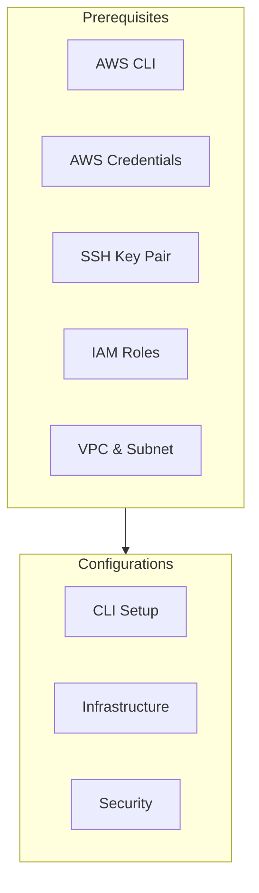
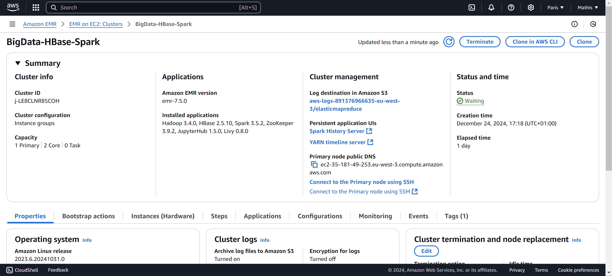
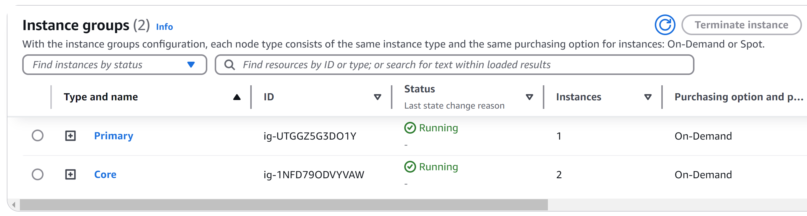
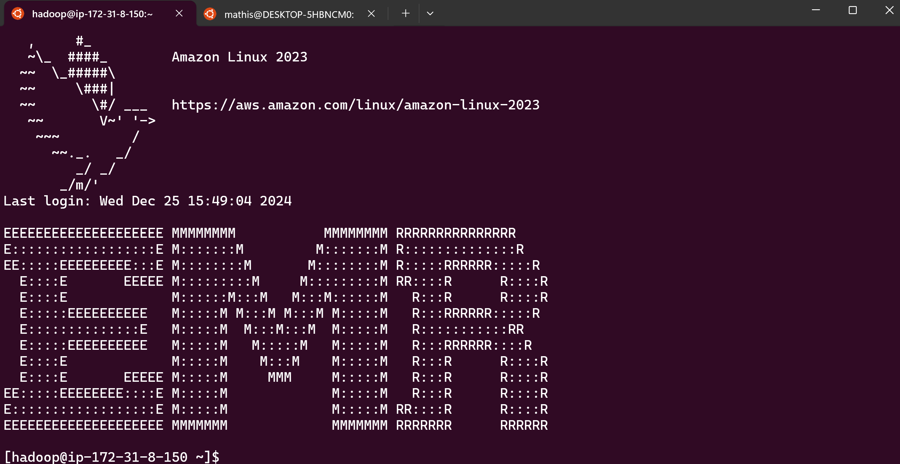
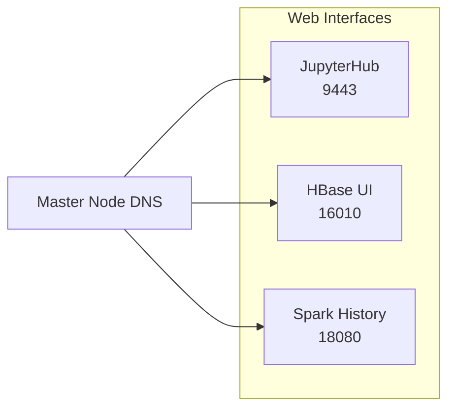

# EMR Cluster Setup for F1 Data Analytics

This guide details setting up an Amazon EMR cluster with HBase and Spark for Formula 1 data analysis. It uses one master and two core nodes on Amazon Linux 2023.

## Prerequisites

Ensure the following are configured:

| Component         | Description                                                                 |
|-----------------|-----------------------------------------------------------------------------|
| **AWS CLI**     | Installed and configured.                                                     |
| **AWS Credentials** | IAM user with permissions for EMR, EC2, IAM, and security groups.          |
| **SSH Key Pair**  | "PolePredict Cluster" in `eu-west-3`.                                        |
| **IAM Roles**     | `AmazonEMR-ServiceRole-20241219T204718`, `AmazonEMR-InstanceProfile-20241219T204701`. |
| **VPC & Subnet**  | VPC (`vpc-063a9ec520f6871a7`) and subnet (`subnet-08ea540a579532ef6`) in `eu-west-3`. |

**Skill Requirements:** Basic AWS Console, EC2, EMR, IAM, VPC, security groups, Linux CLI, and SSH knowledge.



## Installation Steps

### AWS CLI Configuration

```bash
# Installation (if needed)
sudo apt-get update && sudo apt-get install awscli -y
aws --version

# Configuration
aws configure
# Enter Access Key ID, Secret Access Key, region (eu-west-3), and output format (json)
```

### Infrastructure Verification

```bash
# VPC
aws ec2 describe-vpcs --vpc-ids vpc-063a9ec520f6871a7
# Subnet
aws ec2 describe-subnets --subnet-ids subnet-08ea540a579532ef6
# IAM Roles
aws iam list-roles | grep -E "EMR|emr"
aws iam get-role --role-name AmazonEMR-ServiceRole-20241219T204718
aws iam get-instance-profile --instance-profile-name AmazonEMR-InstanceProfile-20241219T204701
```

**Important:** Ensure `AmazonEMR-ServiceRole-20241219T204718` can create security groups. See `problems.md` for details.

### Cluster Creation

1. **Create `create_cluster.sh`:**

    ```bash
    #!/bin/bash

    CLUSTER_NAME="BigData-HBase-Spark"
    REGION="eu-west-3"
    EMR_VERSION="emr-7.5.0"
    LOG_URI="s3://aws-logs-891376966635-eu-west-3/elasticmapreduce"
    SERVICE_ROLE="arn:aws:iam::891376966635:role/service-role/AmazonEMR-ServiceRole-20241219T204718"
    SUBNET_ID="subnet-08ea540a579532ef6"

    aws emr create-cluster \
      --name "${CLUSTER_NAME}" \
      --release-label "${EMR_VERSION}" \
      --region "${REGION}" \
      --log-uri "${LOG_URI}" \
      --service-role "${SERVICE_ROLE}" \
      --applications Name=Hadoop Name=HBase Name=Spark Name=ZooKeeper Name=JupyterHub Name=Livy \
      --unhealthy-node-replacement \
      --tags 'for-use-with-amazon-emr-managed-policies=true' \
      --ec2-attributes "{
        \"InstanceProfile\":\"AmazonEMR-InstanceProfile-20241219T204701\",
        \"SubnetId\":\"${SUBNET_ID}\",
        \"KeyName\":\"PolePredict Cluster\"
      }" \
      --instance-groups "[
        {
          \"InstanceCount\":1,
          \"InstanceGroupType\":\"MASTER\",
          \"Name\":\"Primary\",
          \"InstanceType\":\"m7g.xlarge\",
          \"EbsConfiguration\":{
            \"EbsBlockDeviceConfigs\":[
              {
                \"VolumeSpecification\":{
                  \"VolumeType\":\"gp3\",
                  \"SizeInGB\":50
                },
                \"VolumesPerInstance\":1
              }
            ]
          }
        },
        {
          \"InstanceCount\":2,
          \"InstanceGroupType\":\"CORE\",
          \"Name\":\"Core\",
          \"InstanceType\":\"r7i.xlarge\",
          \"EbsConfiguration\":{
            \"EbsBlockDeviceConfigs\":[
              {
                \"VolumeSpecification\":{
                  \"VolumeType\":\"gp3\",
                  \"SizeInGB\":150
                },
                \"VolumesPerInstance\":1
              }
            ]
          }
        }
      ]" \
      --scale-down-behavior "TERMINATE_AT_TASK_COMPLETION" \
      --ebs-root-volume-size "50"
    ```

2. **Key Configuration Parameters:**

    | Parameter          | Value                                                                      |
    |--------------------|----------------------------------------------------------------------------|
    | `--name`           | BigData-HBase-Spark                                                        |
    | `--release-label`  | emr-7.5.0 (Hadoop 3.4.0, HBase 2.5.10, Spark 3.5.2, ZooKeeper 3.9.2, JupyterHub 1.5.0, Livy 0.8.0) |
    | `--region`         | eu-west-3                                                                  |
    | `--service-role`   | arn:aws:iam::891376966635:role/service-role/AmazonEMR-ServiceRole-20241219T204718 |
    | `--ec2-attributes` | InstanceProfile: AmazonEMR-InstanceProfile-20241219T204701, SubnetId: subnet-08ea540a579532ef6, KeyName: PolePredict Cluster |
    | `--instance-groups`| 1 MASTER (m7g.xlarge, 50GB gp3), 2 CORE (r7i.xlarge, 150GB gp3)            |
    | `--log-uri`        | s3://aws-logs-891376966635-eu-west-3/elasticmapreduce                      |

3. **Execute Script:**

    ```bash
    chmod +x create_cluster.sh
    ./create_cluster.sh
    ```

    

### Cluster Verification

```bash
aws emr describe-cluster --cluster-id <your-cluster-id>
aws emr list-clusters --active
```

Monitor cluster state transitions: STARTING -> BOOTSTRAPPING -> RUNNING -> WAITING.



### Access Configuration

#### SSH Access

1. **Get Master Node DNS:**

    ```bash
    aws emr describe-cluster --cluster-id <your-cluster-id> \
        --query 'Cluster.MasterPublicDnsName'
    ```

2. **Authorize SSH (port 22) in Master Node Security Group:**

    ```bash
    # Get Security Group ID
    aws emr describe-cluster --cluster-id <your-cluster-id> \
        --query 'Cluster.Ec2InstanceAttributes.EmrManagedMasterSecurityGroup'

    # Authorize Ingress (Replace <security-group-id> and consider restricting CIDR)
    aws ec2 authorize-security-group-ingress \
        --group-id <security-group-id> \
        --protocol tcp \
        --port 22 \
        --cidr 0.0.0.0/0
    ```

3. **SSH Connection:**

    **WSL Users:**
    ```bash
    cp "/mnt/c/path/to/PolePredict Cluster.pem" ~/
    cd ~
    chmod 400 "PolePredict Cluster.pem"
    ssh -i "PolePredict Cluster.pem" hadoop@<master-public-dns>
    ```

    **Non-WSL Users:**
    ```bash
    chmod 400 "PolePredict Cluster.pem"
    ssh -i "PolePredict Cluster.pem" hadoop@<master-public-dns>
    ```

    

#### Web Interface Access

Available after ~15-20 minutes in `RUNNING` state:

-   JupyterHub: `https://<master-node-dns>:9443`
-   HBase UI: `http://<master-node-dns>:16010`
-   Spark History Server: `http://<master-node-dns>:18080`



## Cluster Details

-   **Cluster ID:**  (e.g., j-LE8CLNR85COH)
-   **EMR Version:** `emr-7.5.0`
-   **Applications:** Hadoop 3.4.0, HBase 2.5.10, Spark 3.5.2, ZooKeeper 3.9.2, JupyterHub 1.5.0, Livy 0.8.0
-   **OS:** Amazon Linux 2023

## Troubleshooting

Refer to `problems.md` for troubleshooting common issues like instance type availability, SSH connection problems, web interface inaccessibility, and IAM role permissions.

## Conclusion

This condensed guide helps you set up an EMR cluster for F1 data analysis. Consult `problems.md` for further assistance.
