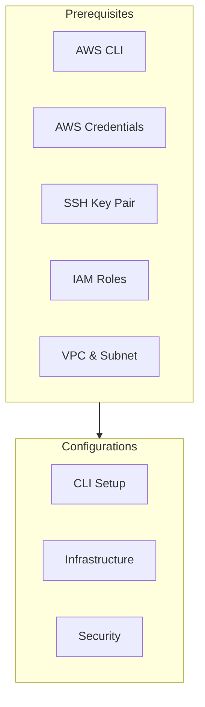
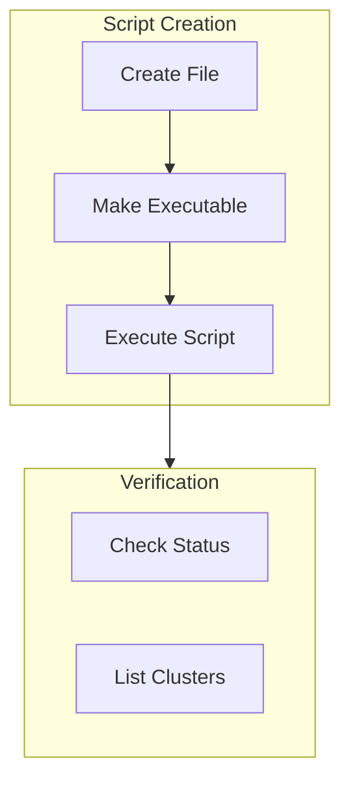

# EMR Cluster Installation Guide

## Overview
This guide provides step-by-step instructions for setting up an Amazon EMR cluster with HBase and Spark for Formula 1 data analysis. The cluster consists of one master node and two core nodes, running on Amazon Linux 2023.

## Prerequisites

### Required Components


- AWS CLI installed and configured
- AWS credentials with appropriate permissions
- SSH key pair "PolePredict Cluster"
- IAM roles configured
- VPC and subnet in eu-west-3 (Paris) region

## Installation Steps

### 1. AWS CLI Configuration

First, install and configure the AWS CLI:

```bash
# Install AWS CLI
sudo apt-get update
sudo apt-get install awscli

# Configure AWS CLI
aws configure
# Enter your AWS Access Key ID
# Enter your AWS Secret Access Key
# Default region: eu-west-3
# Default output format: json
```

### 2. Infrastructure Verification

Verify your AWS infrastructure components:

```bash
# Check VPC configuration
aws ec2 describe-vpcs

# Check available subnets
aws ec2 describe-subnets

# Verify EMR IAM roles
aws iam list-roles | grep -E "EMR|emr"
```

### 3. Cluster Creation

Create and execute the cluster creation script:



1. Create `create_cluster.sh`:
```bash
#!/bin/bash

CLUSTER_NAME="BigData-HBase-Spark"
REGION="eu-west-3"
EMR_VERSION="emr-7.5.0"
# ... [rest of the script content]
```

2. Set permissions and run:
```bash
chmod +x create_cluster.sh
./create_cluster.sh
```

After execution, you should see your cluster in the EMR console:


### 4. Cluster Verification

Monitor the cluster creation:

```bash
# Get cluster status
aws emr describe-cluster --cluster-id j-LE8CLNR85COH

# List active clusters
aws emr list-clusters --active
```

Current cluster configuration:


### 5. Access Configuration

#### SSH Access Setup

1. Get the master node DNS:
```bash
aws emr describe-cluster --cluster-id j-LE8CLNR85COH \
    --query 'Cluster.MasterPublicDnsName'
```

2. Configure security group access:
```bash
# Get security group ID
aws emr describe-cluster --cluster-id j-LE8CLNR85COH \
    --query 'Cluster.Ec2InstanceAttributes.EmrManagedMasterSecurityGroup'

# Add SSH access
aws ec2 authorize-security-group-ingress \
    --group-id <security-group-id> \
    --protocol tcp \
    --port 22 \
    --cidr 0.0.0.0/0
```

#### SSH Key Setup

For WSL users:
```bash
# Copy key to WSL home directory
cp "PolePredict Cluster.pem" ~/
cd ~
chmod 400 "PolePredict Cluster.pem"

# Connect to cluster
ssh -i "PolePredict Cluster.pem" hadoop@ec2-35-181-49-253.eu-west-3.compute.amazonaws.com
```

Successful connection should show:


For non-WSL users:
```bash
chmod 400 "PolePredict Cluster.pem"
ssh -i "PolePredict Cluster.pem" hadoop@ec2-35-181-49-253.eu-west-3.compute.amazonaws.com
```

### 6. Web Interface Access

The following interfaces are available once the cluster is running:

```mermaid
graph LR
    subgraph Web Interfaces
        JH[JupyterHub\n9443]
        HB[HBase UI\n16010]
        SP[Spark History\n18080]
    end

    DNS[Master Node DNS] --> Web Interfaces
```

Access URLs:
- JupyterHub: `https://<master-node-dns>:9443`
- HBase UI: `http://<master-node-dns>:16010`
- Spark History Server: `http://<master-node-dns>:18080`

## Cluster Details

Current configuration:
- **Cluster ID**: j-LE8CLNR85COH
- **EMR Version**: emr-7.5.0
- **Applications**: Hadoop 3.4.0, HBase 2.5.10, Spark 3.5.2, ZooKeeper 3.9.2, JupyterHub 1.5.0, Livy 0.8.0
- **OS**: Amazon Linux 2023.6.20241031.0

## Troubleshooting

If you encounter issues:
1. Verify security group configurations
2. Check SSH key permissions
3. Ensure proper IAM role assignments
4. Monitor cluster status in EMR console
