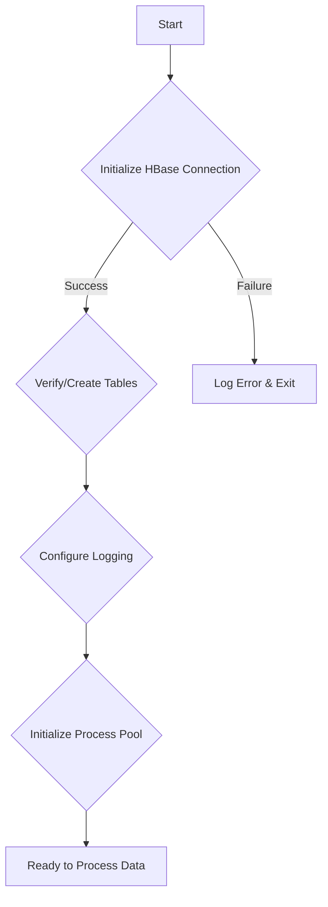
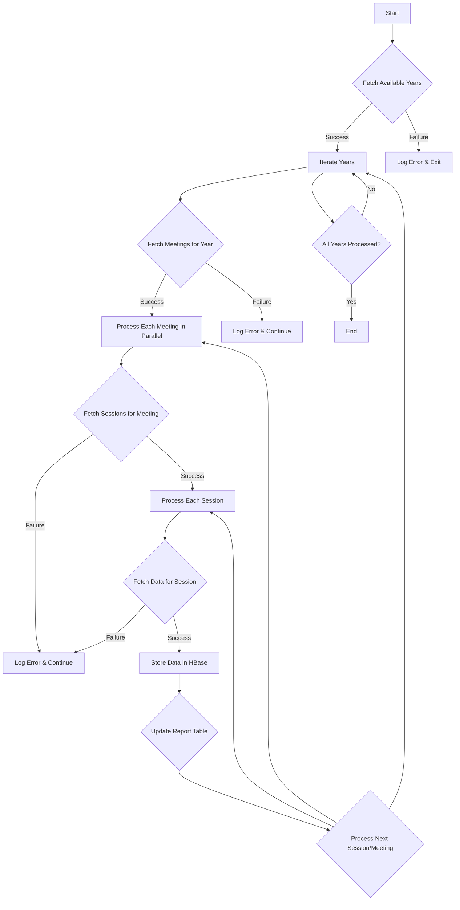
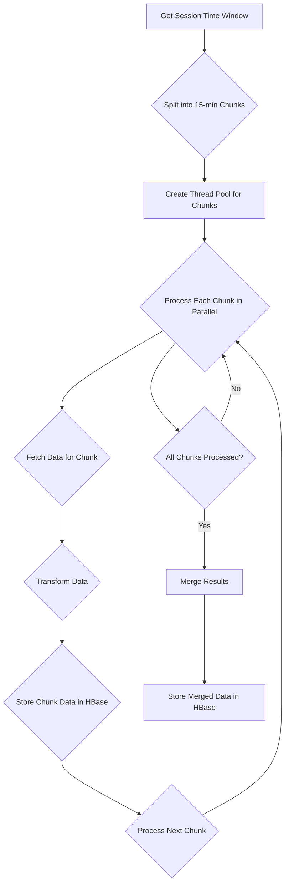

## Documentation: OpenF1 Data Population Script

This document outlines the `hbase_populate_openF1.py` script, a Python application designed to efficiently populate an HBase database with Formula 1 data from the OpenF1 API.

**Key Features:**

*   **Parallel Data Fetching:**  Uses multiprocessing for faster data ingestion.
*   **Asynchronous API Requests:** Employs asynchronous requests with rate limiting for efficient API interaction.
*   **HBase Integration:** Optimizes data storage with batched writes.
*   **Robust Error Handling:** Includes retries with exponential backoff for API failures.
*   **Detailed Logging:** Provides comprehensive tracking of the data population process.

## Technical Architecture

The script has three core components:

| Component               | Purpose                                                                    | Responsibilities                                                                                                                                                                                           | Key Features                                                                                             |
| ----------------------- | -------------------------------------------------------------------------- | --------------------------------------------------------------------------------------------------------------------------------------------------------------------------------------------------------- | -------------------------------------------------------------------------------------------------------- |
| `RequestQueue`          | Manages asynchronous HTTP requests to the OpenF1 API.                       | Sending/receiving requests, rate limiting, retries with exponential backoff, tracking request statistics.                                                                                              | Concurrency control (aiohttp), rate limiting, retry mechanism, timeout handling.                         |
| `HBaseConnector`        | Manages connection to HBase and data storage operations.                     | Establishing/maintaining connection, creating tables/column families, batched data insertion, connection pooling.                                                                                   | Connection pooling, table management, batch operations, error handling.                               |
| `ParallelF1DataCollector` | Orchestrates parallel processing of Formula 1 data.                       | Managing a multiprocessing pool, coordinating data collection across years and sessions, aggregating/storing data, maintaining global statistics.                                                      | Multiprocessing, process pool management, data aggregation, progress tracking.                         |

### Data Model

The script populates two HBase tables:

**`f1_data` Table:** Stores core Formula 1 data.

| Column Family | Description                                                                                                                                 |
| ------------- | ------------------------------------------------------------------------------------------------------------------------------------------- |
| `car`         | Car telemetry data (speed, RPM, gear, throttle, brake, DRS).                                                                              |
| `driver`      | Driver information (code, name, team, number).                                                                                               |
| `intervals`   | Time intervals between cars.                                                                                                                 |
| `laps`        | Lap timing data.                                                                                                                            |
| `location`    | GPS coordinates of cars on the track.                                                                                                      |
| `meeting`     | Race meeting details (name, location, date, official name).                                                                                |
| `pit`         | Pit stop information (lap number, duration, time of pit entry).                                                                            |
| `position`    | Track position data.                                                                                                                        |
| `racecontrol` | Race control messages.                                                                                                                      |
| `session`     | Session details (type, start time, end time).                                                                                               |
| `stints`      | Stint information (tyre compound, stint length).                                                                                             |
| `teamradio`   | Transcripts of team radio communications.                                                                                                   |
| `weather`     | Weather data (temperature, humidity, wind speed, etc.).                                                                                     |

**`f1_reports` Table:** Stores metadata and statistics about the data population process.

| Column Family | Description                                                                                |
| ------------- | ------------------------------------------------------------------------------------------ |
| `meta`        | Metadata about the data population process (script version, execution time, etc.).           |
| `stats`       | Processing statistics (number of records processed, API requests, errors, etc.).          |
| `errors`      | Detailed error logs for debugging and troubleshooting.                                    |

### Row Key Design

| Data Type             | Row Key Format                                                      |
| --------------------- | ------------------------------------------------------------------- |
| Time Series Data      | `{year}#{meeting_key}#{session_key}#{driver_number}#{timestamp}`   |
| Lap Data              | `{year}#{meeting_key}#{session_key}#{driver_number}#{lap_number}` |
| Meeting/Session Data | `{year}#{meeting_key}#{session_key}`                               |

**Rationale:** Enables efficient data retrieval based on time, meetings, sessions, and drivers.

## Implementation Details

*   **Parallel Processing:** Utilizes `multiprocessing` with a configurable pool size (default: 10) to process race meetings concurrently, optimizing resource utilization.
*   **Error Handling:** Implements automatic retries with configurable count and exponential backoff for API request failures. The script also handles process crashes and provides graceful shutdown.
*   **Configuration:**  Customizable through the `CONFIG` dictionary:

    ```python
    CONFIG = {
        "max_retries": 3,
        "retry_delay": 5,
        "request_timeout": 60,
        "delay_between_requests": 1,
        "max_concurrent_requests": 5,
        "time_interval": 900  # 15 minutes chunk size
    }
    ```
*   **Logging:**  Uses `colorama` for colored console output and maintains a detailed log file (`populate.log`) with different log levels and progress tracking.

## Usage

### Prerequisites

*   **Python 3.8+**
*   **Required Python Packages:**
    ```bash
    pip install requests==2.31.0
    pip install happybase==1.2.0
    pip install aiohttp==3.9.3
    pip install colorama==0.4.6
    ```
*   **Running HBase Cluster**
*   **OpenF1 API Access**

### Running the Script

```bash
python hbase_populate_openF1.py
```

### Monitoring

The script provides real-time progress updates and logs.


### Data Ingestion Verification


## Data Flow and Processing

### API Integration Details

*   **Base URL:** `https://api.openf1.org/v1`
*   **Authentication:** Not required for public data.
*   **Rate Limiting:** Implemented to avoid overwhelming the API (default: 5 concurrent requests, 1-second delay).

| Endpoint Type          | Endpoint Name   | Description                                                                                      | Parameters                                    |
| ---------------------- | --------------- | ------------------------------------------------------------------------------------------------ | --------------------------------------------- |
| **High-Frequency (4Hz)** | `/car_data`     | Retrieves car telemetry data.                                                                    | `date>`, `date<`, `meeting_key`, `session_key` |
|                        | `/location`     | Retrieves GPS coordinates of cars.                                                               | `date>`, `date<`, `meeting_key`, `session_key` |
| **Standard**           | `/drivers`      | Retrieves driver information.                                                                    |                                               |
|                        | `/intervals`    | Retrieves time interval data between cars.                                                       |                                               |
|                        | `/laps`         | Retrieves lap timing information.                                                                |                                               |
|                        | `/pit`          | Retrieves pit stop details.                                                                      |                                               |
|                        | `/position`     | Retrieves track position data.                                                                   |                                               |
|                        | `/race_control` | Retrieves race control messages.                                                                 |                                               |
|                        | `/stints`       | Retrieves stint information.                                                                     |                                               |
|                        | `/team_radio`   | Retrieves team radio transcripts.                                                                |                                               |
| **Metadata**           | `/meetings`     | Retrieves race meeting information.                                                              |                                               |
|                        | `/sessions`     | Retrieves session details within a race meeting.                                                 |                                               |

### Data Processing Pipeline Details







### Error Handling and Recovery

The script handles network errors, HBase errors, data validation errors, and resource exhaustion. Recovery strategies include automatic retries with exponential backoff for transient errors, graceful degradation for missing data, session continuation after partial failures, and potential transaction rollback capabilities (application-level logic).

## Monitoring and Operations

### Real-time Monitoring

*   **Console Output:** Provides live updates on the data population process.
*   **HBase Monitoring Commands:**
    ```bash
    # Check table status
    echo "status 'f1_data'" | hbase shell

    # Count records in a table
    echo "count 'f1_data'" | hbase shell

    # Check data distribution across regions
    echo "scan 'f1_data', {LIMIT => 10}" | hbase shell

    # Monitor region server status
    hbase hbck
    ```
*   **Performance Metrics:** Tracks records processed per second, API latency, HBase write latency, and thread pool utilization.

### Operational Procedures

*   **Pre-execution Checklist:**
    ```bash
    # 1. Verify HBase connection
    python hbase_test_connection.py

    # 2. Check available disk space on HBase nodes
    df -h

    # 3. Verify AWS EMR cluster status
    aws emr describe-cluster --cluster-id <your-cluster-id>

    # 4. Test API access (replace with a valid year)
    curl "https://api.openf1.org/v1/meetings?year=2023"
    ```
*   **Execution Command:**
    ```bash
    nohup python hbase_populate_openF1.py > populate.log 2>&1 &
    ```
*   **Monitoring During Execution:**
    ```bash
    # Follow log output in real-time
    tail -f populate.log

    # Check process status
    ps aux | grep hbase_populate_openF1.py

    # Monitor system resource usage (replace 'hadoop' with the appropriate user)
    top -u hadoop
    ```
*   **Post-execution Verification:**
    ```bash
    # Check for errors in the log file
    grep ERROR populate.log

    # Verify data in HBase (replace with your table name)
    echo "count 'f1_data'" | hbase shell

    # Check the report table for completion status and statistics
    echo "scan 'f1_reports'" | hbase shell
    ```

## Performance Considerations

### Performance Tuning

*   **Configuration Parameters:**
    *   `MAX_CONCURRENT_REQUESTS = 5`
    *   `time_interval = 900` seconds
    *   HBase client settings with increased timeout, framed transport, and compact protocol.
*   **Resource Requirements:** Memory (approx. 100MB per process), stable network, sufficient CPU cores, and HBase storage capacity.

### Optimization Techniques

*   **Chunked Processing:** Processes high-frequency data in 15-minute chunks.
*   **Connection Management:** Reuses HBase connections through pooling and uses asynchronous HTTP requests.
*   **Data Batching:** Uses HBase batch operations for efficient data insertion.
*   **Asynchronous Operations:** Employs `aiohttp` for efficient API communication.

## Conclusion

The `hbase_populate_openF1.py` script offers a robust and efficient method for populating an HBase database with Formula 1 data from the OpenF1 API. Its design emphasizes parallel processing, error resilience, and comprehensive logging, making it suitable for large-scale data ingestion and ensuring accurate and timely data for analysis.
