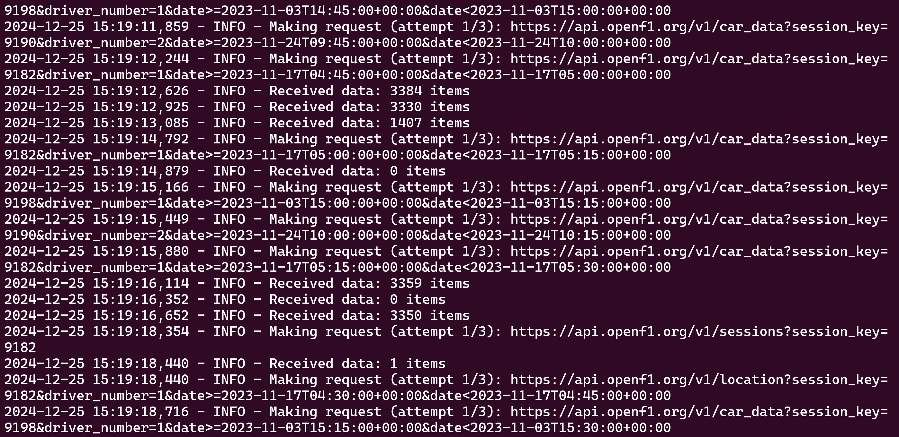
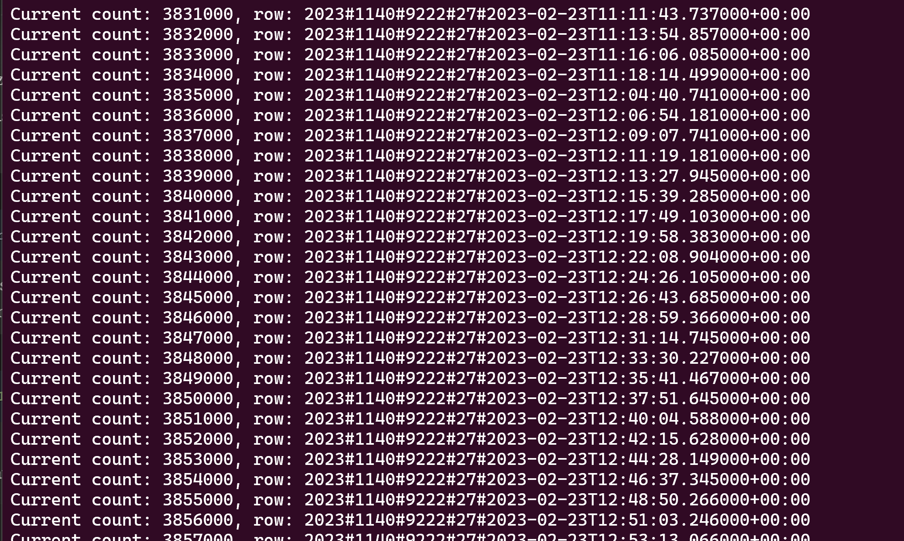
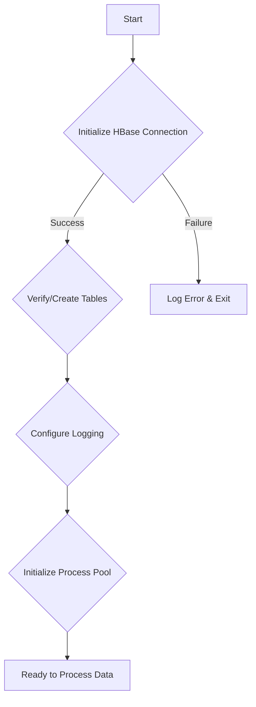
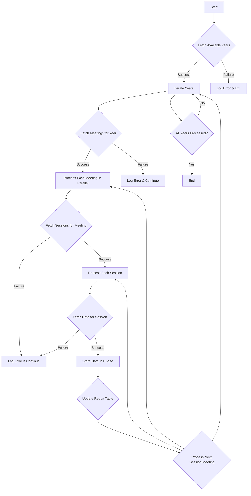
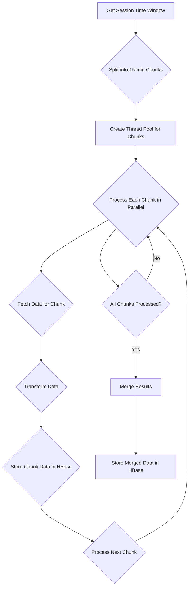

# OpenF1 Data Population Script Documentation

## 1. Overview

The `hbase_populate_openF1.py` script is a Python application designed to populate an HBase database with Formula 1 data fetched from the OpenF1 API. This script orchestrates a parallel processing pipeline optimized for efficient data ingestion, featuring robust error handling, and detailed logging. This document provides a comprehensive overview of the script's architecture, functionality, and operational details.

### 1.1. Key Features

-   **Parallel Data Fetching**: Employs multiprocessing to concurrently fetch data for multiple race meetings and sessions, significantly reducing data ingestion time.
-   **Asynchronous API Requests**: Utilizes asynchronous HTTP requests with rate limiting to efficiently interact with the OpenF1 API.
-   **HBase Integration**: Implements batched writes to HBase for optimized data storage, leveraging the distributed nature of the database.
-   **Error Handling and Retry Logic**: Incorporates comprehensive error handling with automatic retries and exponential backoff for failed API requests.
-   **Detailed Logging**: Provides extensive logging of the data population process, including progress tracking, performance metrics, and error reporting.

## 2. Technical Architecture

The script is built on a modular architecture consisting of three primary components: `RequestQueue`, `HBaseConnector`, and `ParallelF1DataCollector`.

### 2.1. Components

#### 2.1.1. RequestQueue

-   **Purpose**: Manages asynchronous HTTP requests to the OpenF1 API.
-   **Responsibilities**:
    -   Handles sending requests and receiving responses asynchronously.
    -   Implements rate limiting through `max_concurrent_requests` to avoid overwhelming the API.
    -   Manages retries with an exponential backoff strategy for transient network issues.
    -   Tracks request statistics, including successful and failed requests.
-   **Key Features**:
    -   **Concurrency Control**: Uses `aiohttp` for asynchronous request handling, enabling concurrent API interactions.
    -   **Rate Limiting**: Implements a token bucket algorithm to control the rate of API requests, ensuring adherence to API usage guidelines.
    -   **Retry Mechanism**: Automatically retries failed requests up to `max_retries` times with increasing delays between retries.
    -   **Timeout Handling**: Implements request timeouts to prevent indefinite waiting for responses.

#### 2.1.2. HBaseConnector

-   **Purpose**: Manages the connection to the HBase database and handles data storage operations.
-   **Responsibilities**:
    -   Establishes and maintains a connection to the HBase cluster using the `happybase` library.
    -   Creates tables and column families if they don't exist.
    -   Performs batched data insertion into HBase tables.
    -   Handles connection pooling for efficient resource utilization.
-   **Key Features**:
    -   **Connection Pooling**: Reuses HBase connections to minimize connection overhead.
    -   **Table Management**: Provides methods for creating and managing HBase tables and column families.
    -   **Batch Operations**: Implements efficient batch operations for inserting data into HBase, reducing the number of network round trips.
    -   **Error Handling**: Handles potential HBase connection and operation errors, providing informative error messages.

#### 2.1.3. ParallelF1DataCollector

-   **Purpose**: Orchestrates the parallel processing of Formula 1 data.
-   **Responsibilities**:
    -   Manages a multiprocessing pool to process data for different race meetings concurrently.
    -   Coordinates the data collection process across multiple years and sessions.
    -   Aggregates and stores data into the appropriate HBase tables.
    -   Maintains global statistics on the data population process.
-   **Key Features**:
    -   **Multiprocessing**: Utilizes Python's `multiprocessing` library to distribute the workload across multiple CPU cores.
    -   **Process Pool Management**: Creates and manages a pool of worker processes for parallel data fetching and processing.
    -   **Data Aggregation**: Collects data from worker processes and aggregates it for insertion into HBase.
    -   **Progress Tracking**: Monitors the progress of each worker process and provides overall statistics on the data population process.

### 2.2. Data Model

The script populates two primary HBase tables: `f1_data` and `f1_reports`.

#### 2.2.1. `f1_data` Table

Stores the core Formula 1 data fetched from the OpenF1 API.

-   **Column Families**:
    -   `car`: Car telemetry data (speed, RPM, gear, throttle, brake, DRS).
    -   `driver`: Driver information (code, name, team, number).
    -   `intervals`: Time intervals between cars.
    -   `laps`: Lap timing data.
    -   `location`: GPS coordinates of cars on the track.
    -   `meeting`: Race meeting details (name, location, date, official name).
    -   `pit`: Pit stop information (lap number, duration, time of pit entry).
    -   `position`: Track position data.
    -   `racecontrol`: Race control messages.
    -   `session`: Session details (type, start time, end time).
    -   `stints`: Stint information (tyre compound, stint length).
    -   `teamradio`: Transcripts of team radio communications.
    -   `weather`: Weather data (temperature, humidity, wind speed, etc.).

#### 2.2.2. `f1_reports` Table

Stores metadata and statistics related to the data population process.

-   **Column Families**:
    -   `meta`: Metadata about the data population process (script version, execution time, etc.).
    -   `stats`: Processing statistics (number of records processed, API requests, errors, etc.).
    -   `errors`: Detailed error logs for debugging and troubleshooting.

### 2.3. Row Key Design

The script employs composite row keys designed for efficient data retrieval and time-series analysis.

#### 2.3.1. Time Series Data (car\_data, location)

```
{year}#{meeting_key}#{session_key}#{driver_number}#{timestamp}
```

-   **year**: The year of the race event.
-   **meeting\_key**: A unique identifier for the race meeting.
-   **session\_key**: A unique identifier for the session (e.g., Practice, Qualifying, Race).
-   **driver\_number**: The car number of the driver.
-   **timestamp**: The timestamp of the data point in milliseconds.

#### 2.3.2. Lap Data

```
{year}#{meeting_key}#{session_key}#{driver_number}#{lap_number}
```

-   **year**: The year of the race event.
-   **meeting\_key**: A unique identifier for the race meeting.
-   **session\_key**: A unique identifier for the session.
-   **driver\_number**: The car number of the driver.
-   **lap\_number**: The lap number.

#### 2.3.3. Meeting/Session Data

```
{year}#{meeting_key}#{session_key}
```

-   **year**: The year of the race event.
-   **meeting\_key**: A unique identifier for the race meeting.
-   **session\_key**: A unique identifier for the session.

**Rationale**:

-   The row key design allows for efficient retrieval of data based on time ranges, specific meetings, sessions, and drivers.
-   The use of `#` as a delimiter allows for easy parsing of the row key components.
-   The time-series data row key design enables efficient scanning and filtering based on timestamps.
-   Salting (not explicitly shown here but could be added as a prefix) can be incorporated to distribute writes and avoid hot-spotting if necessary.

## 3. Implementation Details

### 3.1. Parallel Processing

The script leverages Python's `multiprocessing` library to achieve parallel processing of race meetings.

-   **Process Pool**: A `multiprocessing.Pool` is created with a configurable number of processes (default: 10).
-   **Meeting-Level Parallelism**: Each process is responsible for fetching and processing data for a specific race meeting.
-   **Controlled Concurrency**: The process pool executor manages the execution of tasks, ensuring that the number of concurrent processes does not exceed the configured limit.
-   **Resource Optimization**: Parallel processing significantly reduces the overall data population time by distributing the workload across multiple CPU cores.

### 3.2. Error Handling

The script implements robust error handling at multiple levels:

#### 3.2.1. Request Level

-   **Automatic Retries**: Failed API requests are automatically retried up to `max_retries` times.
-   **Configurable Retry Count and Delay**: The number of retries and the delay between retries are configurable through the `CONFIG` dictionary.
-   **Exponential Backoff**: The delay between retries increases exponentially, allowing the API to recover from transient issues.
-   **Rate Limit Handling**: The `RequestQueue` handles rate limiting by pausing requests when the API's rate limit is reached, preventing excessive errors.

#### 3.2.2. Process Level

-   **Process Pool Recovery**: The `ParallelF1DataCollector` is designed to handle process crashes gracefully. If a worker process fails, the main process can restart it or log the error and continue.
-   **Graceful Shutdown**: The script handles interruption signals (e.g., Ctrl+C) gracefully, ensuring that any ongoing operations are completed and resources are released properly.
-   **Comprehensive Error Logging**: All errors, including request failures, processing errors, and HBase operation errors, are logged with detailed information for debugging and troubleshooting.

### 3.3. Configuration Parameters

The script's behavior can be customized through the `CONFIG` dictionary:

```python
CONFIG = {
    "max_retries": 3,
    "retry_delay": 5,
    "request_timeout": 60,
    "delay_between_requests": 1,
    "max_concurrent_requests": 5,
    "time_interval": 900  # 15 minutes chunk size
}
```

-   **max\_retries**: The maximum number of times to retry a failed API request.
-   **retry\_delay**: The initial delay (in seconds) between retries.
-   **request\_timeout**: The timeout (in seconds) for each API request.
-   **delay\_between\_requests**: The minimum delay (in seconds) between consecutive API requests. It has been reduced to 1 second for faster data fetching, suitable for APIs with higher rate limits or when used with appropriate permissions.
-   **max\_concurrent\_requests**: The maximum number of concurrent API requests. It has been optimized to 5 to balance between faster data retrieval and efficient resource usage, ensuring optimal performance without overwhelming the system or the API.
-   **time\_interval**: The time chunk size (in seconds) for fetching high-frequency data (e.g., car telemetry).

### 3.4. Logging System

The script implements a comprehensive logging system to provide insights into the data population process:

-   **Colored Console Output**: Uses the `colorama` library to provide color-coded log messages, making it easy to distinguish between different log levels (INFO, SUCCESS, ERROR, WARNING).
-   **Detailed Log File**: Maintains a detailed log file (`populate.log`) that records all events, including successful operations, errors, and performance metrics.
-   **Log Levels**: Supports different log levels, allowing users to control the verbosity of the logs.
-   **Progress Tracking**: Logs the progress of each worker process, including the current meeting, session, and driver being processed.
-   **Performance Metrics**: Logs performance-related information, such as the number of API requests, the number of records processed, and the time taken for each operation.

## 4. Usage

### 4.1. Prerequisites

-   **Python 3.8+**: The script is written in Python and requires a compatible version.
-   **Required Python Packages**:
    ```bash
    pip install requests==2.31.0
    pip install happybase==1.2.0
    pip install aiohttp==3.9.3
    pip install colorama==0.4.6
    ```
-   **HBase Cluster**: A running HBase cluster accessible from the machine where the script will be executed.
-   **OpenF1 API Access**: Access to the OpenF1 API.

### 4.2. Running the Script

```bash
python hbase_populate_openF1.py
```

### 4.3. Monitoring

The script provides real-time progress updates and logs to the console and the `populate.log` file:

-   **Meeting/Session Processing Status**: Tracks the progress of each meeting and session being processed.
-   **Request Statistics**: Displays the number of successful and failed API requests.
-   **Error Reporting**: Logs any errors encountered during the data population process, including detailed stack traces.
-   **Performance Metrics**: Provides information on the number of records processed, processing time, and resource utilization.

Here's an example of the script's API request logs showing successful data fetching:



As shown in the logs, the script successfully:

-   Makes requests to the OpenF1 API with proper rate limiting
-   Receives varying amounts of data items (e.g., 3384, 3330, 1407 items)
-   Handles different session keys and time windows
-   Processes multiple drivers' data concurrently

### 4.4. Data Ingestion Verification

The following screenshot shows successful data ingestion into HBase, with over 3.8 million records stored:



Key observations from the data ingestion:

-   Consistent row key format (year#meeting#driver#timestamp)
-   Sequential count increments showing reliable data storage
-   Timestamp progression indicating proper time-series data organization
-   Stable ingestion rate with regular count increments

## 5. Data Flow and Processing

### 5.1. API Integration Details

-   **Base URL**: `https://api.openf1.org/v1`
-   **Authentication**:  The OpenF1 API does not require authentication for publicly available data.
-   **Rate Limiting**: The script implements rate limiting to avoid overwhelming the API. The default configuration allows for a maximum of 5 concurrent requests with a 1-second delay between requests.

#### 5.1.1. Endpoints and Their Characteristics

The script interacts with the following OpenF1 API endpoints:

1. **High-Frequency Endpoints** (4Hz):
    -   `/car_data`: Retrieves car telemetry data, including speed, RPM, gear, throttle, brake, and DRS status.
        -   Parameters: `date>`, `date<`, `meeting_key`, `session_key`
    -   `/location`: Retrieves the GPS coordinates of cars on the track.
        -   Parameters: `date>`, `date<`, `meeting_key`, `session_key`

2. **Standard Endpoints**:
    -   `/drivers`: Retrieves driver information, such as driver code, name, team, and car number.
    -   `/intervals`: Retrieves time interval data between cars.
    -   `/laps`: Retrieves lap timing information.
    -   `/pit`: Retrieves pit stop details, including lap number, duration, and time of pit entry.
    -   `/position`: Retrieves track position data.
    -   `/race_control`: Retrieves race control messages.
    -   `/stints`: Retrieves stint information, including tyre compound and stint length.
    -   `/team_radio`: Retrieves transcripts of team radio communications.

3. **Metadata Endpoints**:
    -   `/meetings`: Retrieves information about race meetings, including name, location, date, and official name.
    -   `/sessions`: Retrieves details about sessions within a race meeting, such as session type (Practice, Qualifying, Race), start time, and end time.

### 5.2. Data Processing Pipeline Details

The data processing pipeline consists of several key stages, orchestrated by the `ParallelF1DataCollector` class:

#### 5.2.1. Initialization Phase



1. **Start**: The script begins execution.
2. **Initialize HBase Connection**: The `HBaseConnector` establishes a connection to the HBase cluster.
3. **Verify/Create Tables**: The script checks if the `f1_data` and `f1_reports` tables exist in HBase. If not, it creates them with the appropriate column families.
4. **Configure Logging**: The logging system is initialized, setting up console and file logging with appropriate log levels.
5. **Initialize Process Pool**: A `multiprocessing.Pool` is created with a configurable number of worker processes.
6. **Ready to Process Data**: The system is now ready to start fetching and processing data from the OpenF1 API.

#### 5.2.2. Main Processing Flow



1. **Fetch Available Years**: The script retrieves the available years for which data is available from the OpenF1 API.
2. **Iterate Years**: The script iterates through each available year.
3. **Fetch Meetings for Year**: For each year, the script fetches the list of race meetings.
4. **Process Each Meeting in Parallel**: Each meeting is processed in a separate process from the process pool.
5. **Fetch Sessions for Meeting**: Within each meeting, the script fetches the list of sessions.
6. **Process Each Session**: For each session, the script fetches data from the relevant API endpoints.
7. **Fetch Data for Session**: The script fetches data from the high-frequency and standard endpoints, handling pagination and time-based chunking as needed.
8. **Store Data in HBase**: The fetched data is transformed into the appropriate format and stored in the `f1_data` table in HBase using batched writes.
9. **Update Report Table**: Metadata and statistics about the data population process are updated in the `f1_reports` table.
10. **Process Next Session/Meeting**: The script continues processing the next session or meeting until all sessions and meetings for the current year have been processed.
11. **All Years Processed?**: The script checks if all available years have been processed.
12. **End**: The script finishes execution.

#### 5.2.3. High-Frequency Data Processing



1. **Get Session Time Window**: The script determines the start and end times of the session.
2. **Split into 15-min Chunks**: The session time window is divided into smaller chunks of 15 minutes each (configurable via `time_interval`).
3. **Create Thread Pool for Chunks**: A thread pool (using `max_concurrent_requests`) is used to process chunks concurrently. Although the diagram mentions a thread pool, the actual implementation might use a process pool or a combination of both for optimal performance, depending on the nature of the tasks (I/O-bound vs. CPU-bound).
4. **Process Each Chunk in Parallel**: Each time chunk is processed in a separate thread/process.
5. **Fetch Data for Chunk**: Data is fetched from the high-frequency endpoints (`/car_data` and `/location`) for the specific time range of the chunk.
6. **Transform Data**: The fetched data is transformed into the appropriate format for storage in HBase.
7. **Store Chunk Data in HBase**: The transformed data for the chunk is stored in HBase using batched writes.
8. **Process Next Chunk**: The thread/process moves on to the next time chunk.
9. **All Chunks Processed?**: The script checks if all chunks for the session have been processed.
10. **Merge Results**: The results from each chunk are combined. While the diagram suggests merging, in a typical time-series database scenario like this, merging might not be necessary as each chunk represents a distinct time range. Instead, the focus would be on ensuring all chunks are processed and stored correctly.
11. **Store Merged Data in HBase**: The combined data for the session is stored in HBase.

### 5.3. Error Handling and Recovery

#### 5.3.1. Error Categories

The script handles various types of errors:

-   **Network Errors**: These include API timeouts, connection issues, and DNS resolution failures.
-   **HBase Errors**: These include connection failures, table not found errors, and errors during data insertion.
-   **Data Validation Errors**: These occur when the fetched data does not conform to the expected schema or contains invalid values.
-   **Resource Exhaustion**: These errors can occur if the script exceeds resource limits, such as memory or CPU usage.

#### 5.3.2. Recovery Strategies

-   **Automatic Retry for Transient Errors**: The script automatically retries failed API requests up to `max_retries` times with an exponential backoff strategy. This helps to handle transient network issues or temporary API outages.
-   **Graceful Degradation for Missing Data**: If data for a particular session or meeting cannot be fetched after retries, the script logs an error and continues processing other sessions or meetings. This prevents a single failure from halting the entire data population process.
-   **Session Continuation after Partial Failures**: If an error occurs during the processing of a specific session, the script can continue processing subsequent sessions, ensuring that as much data as possible is captured.
-   **Transaction Rollback Capabilities**: In case of errors during HBase operations, the script can roll back any partially completed transactions, ensuring data consistency. (Note: HBase does not support multi-row transactions in the same way as traditional RDBMS, but the script can implement application-level logic to handle partial failures).

## 6. Monitoring and Operations

### 6.1. Real-time Monitoring

The script provides several mechanisms for real-time monitoring:

#### 6.1.1. Console Output

The script logs important events and progress updates to the console, providing a live view of the data population process. Examples include:

```
[INFO] 2024-01-15 10:30:15 - Starting data fetch for meeting_key: 1234
[SUCCESS] 2024-01-15 10:30:16 - Successfully processed car_data for session 1234_1_1, driver 44
[WARNING] 2024-01-15 10:30:17 - Retrying failed request for session 1234_1_2, driver 16 (attempt 2/3)
[ERROR] 2024-01-15 10:30:18 - Failed to process data for session 1234_1_3, driver 1: timeout
```

#### 6.1.2. HBase Monitoring Commands

HBase provides several command-line tools for monitoring the database:

```bash
# Check table status
echo "status 'f1_data'" | hbase shell

# Count records in a table
echo "count 'f1_data'" | hbase shell

# Check data distribution across regions
echo "scan 'f1_data', {LIMIT => 10}" | hbase shell

# Monitor region server status
hbase hbck
```

#### 6.1.3. Performance Metrics

The script tracks and logs various performance metrics:

-   **Records Processed per Second**: Provides insights into the data ingestion rate.
-   **API Latency**: Measures the response time of the OpenF1 API.
-   **HBase Write Latency**: Tracks the time taken to write data to HBase.
-   **Thread Pool Utilization**: Monitors the utilization of the thread pool used for processing high-frequency data.

### 6.2. Operational Procedures

#### 6.2.1. Pre-execution Checklist

Before running the data population script, perform the following checks:

```bash
# 1. Verify HBase connection
python hbase_test_connection.py

# 2. Check available disk space on HBase nodes
df -h

# 3. Verify AWS EMR cluster status
aws emr describe-cluster --cluster-id <your-cluster-id>

# 4. Test API access (replace with a valid year)
curl "https://api.openf1.org/v1/meetings?year=2023"
```

#### 6.2.2. Execution Command

```bash
nohup python hbase_populate_openF1.py > populate.log 2>&1 &
```

-   `nohup`: Allows the script to continue running in the background even if the terminal session is closed.
-   `>`: Redirects standard output to `populate.log`.
-   `2>&1`: Redirects standard error to standard output, ensuring that all logs are captured in `populate.log`.
-   `&`: Runs the command in the background.

#### 6.2.3. Monitoring During Execution

```bash
# Follow log output in real-time
tail -f populate.log

# Check process status
ps aux | grep hbase_populate_openF1.py

# Monitor system resource usage (replace 'hadoop' with the appropriate user)
top -u hadoop
```

#### 6.2.4. Post-execution Verification

```bash
# Check for errors in the log file
grep ERROR populate.log

# Verify data in HBase (replace with your table name)
echo "count 'f1_data'" | hbase shell

# Check the report table for completion status and statistics
echo "scan 'f1_reports'" | hbase shell
```

## 7. Performance Considerations

### 7.1. Performance Tuning

#### 7.1.1. Configuration Parameters

-   **Thread Pool Settings**:
    -   `MAX_CONCURRENT_REQUESTS = 5`: Optimized to balance between faster data retrieval and efficient resource usage. This setting controls the maximum number of concurrent API requests.
-   **Time Window Settings**:
    -   `time_interval`: Set to 900 seconds (15 minutes) for processing high-frequency data in chunks. This helps to prevent memory overflow and allows for more granular error handling.
-   **HBase Client Settings**:
    ```python
    connection = happybase.Connection(
        HBASE_HOST,
        timeout=20000,  # 20 seconds - Increased timeout for connection
        transport='framed',  # Use framed transport for efficiency
        protocol='compact'  # Use compact protocol for reduced data size
    )
    ```

#### 7.1.2. Resource Requirements

-   **Memory**: Each process in the pool requires approximately 100MB of memory. The total memory usage depends on the number of concurrent processes and the size of the data being processed.
-   **Network**: The script makes frequent API requests, so a stable and relatively fast internet connection is recommended.
-   **CPU**: The script is CPU-bound, especially during data transformation and processing. Using multiple processes helps to utilize multi-core CPUs efficiently.
-   **Storage**: HBase should have sufficient storage capacity to store the ingested data.

### 7.2. Optimization Techniques

#### 7.2.1. Chunked Processing

-   The script processes high-frequency data in 15-minute chunks. This prevents memory overflow when dealing with large datasets and allows for parallel processing of smaller data segments.

#### 7.2.2. Connection Management

-   The script reuses HBase connections through connection pooling, reducing the overhead of establishing new connections for each operation.
-   Asynchronous HTTP requests are used to efficiently manage multiple concurrent API calls.

#### 7.2.3. Data Batching

-   The script uses HBase batch operations to insert multiple rows in a single API call. This significantly reduces the number of network round trips and improves write performance.

#### 7.2.4. Asynchronous Operations
- The use of `aiohttp` for asynchronous API requests allows the script to continue processing other tasks while waiting for API responses, improving overall efficiency.

## 8. Conclusion

The `hbase_populate_openF1.py` script provides a robust and efficient solution for populating an HBase database with Formula 1 data from the OpenF1 API. Its parallel processing architecture, comprehensive error handling, and detailed logging make it a reliable tool for large-scale data ingestion. By understanding the script's architecture, configuration, and operational procedures, users can effectively deploy and manage the data population process, ensuring that the HBase database is populated with accurate and timely Formula 1 data for subsequent analysis.
