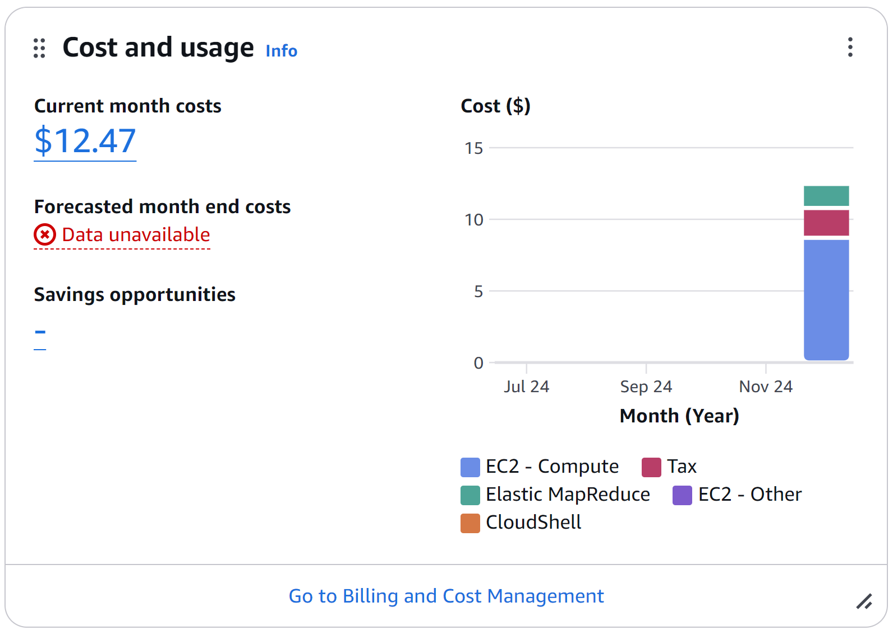

# EMR Cluster Problems and Solutions

## Instance Type Availability Issues

### Problem 1: r7g.xlarge Not Available
**Error Message:**
```
An error occurred (ValidationException) when calling the RunJobFlow operation: Instance type 'r7g.xlarge' is not supported.
```

**Solution:**
- Changed instance type to r7i.xlarge which is available in eu-west-3 region
- Alternative solution would be to use r5.xlarge

### Problem 2: Instance Type Performance
**Observation:**
Initially planned to use t3.small/medium instances for cost savings.

**Solution:**
- Opted for r7i.xlarge for core nodes to ensure adequate memory for HBase
- Selected m7g.xlarge for master node to handle cluster management efficiently

## Storage Configuration

### Problem 1: EBS Volume Size
**Issue:**
Initial 32GB storage was insufficient for HDFS replication.

**Solution:**
- Increased EBS volume size to 150GB for core nodes
- Configured gp3 volumes for better performance
- Set 50GB for master node

### Problem 2: HDFS Replication Factor
**Issue:**
Default replication factor of 3 caused under-replication with only 2 core nodes.

**Solution:**
1. Modified HDFS configuration:
```bash
sudo vim /etc/hadoop/conf/hdfs-site.xml
# Added dfs.replication=2
```

2. Modified HBase configuration:
```bash
sudo vim /etc/hbase/conf/hbase-site.xml
# Added dfs.replication=2
```

3. Applied changes:
```bash
sudo systemctl restart hadoop-hdfs-namenode
sudo systemctl start hbase-master
hdfs dfs -setrep -w 2 -R /user/hbase
```

**Challenges:**
- Region servers required manual restart
- Some files remained under-replicated initially
- WAL files blocked replication process

**Verification Process:**
```bash
# Check replication factor
hdfs getconf -confKey dfs.replication

# Monitor replication status
hdfs dfsadmin -report

# Verify block replication
hdfs fsck /user/hbase -files -blocks
```

## Application Stack Integration

### Problem: JupyterHub Access
**Issue:**
JupyterHub not accessible after cluster creation.

**Solution:**
- Wait for cluster to fully initialize (takes ~15-20 minutes)
- Verify security group allows inbound traffic on port 9443
- Access via master node public DNS

## Networking

### Problem: Subnet Configuration
**Issue:**
Multiple subnets available in VPC.

**Solution:**
- Selected subnet-08ea540a579532ef6 in eu-west-3a
- Ensures all nodes are in same availability zone
- Reduces inter-node latency

## SSH Issues

### Problem 1: Invalid SSH Key Name
**Error Message:**
```
VALIDATION_ERROR_INVALID_SSH_KEY_NAME
Your cluster has terminated because the key pair name that you provided to SSH into the primary instance is invalid
```

**Solution:**
1. Create SSH key pair in eu-west-3 region:
```bash
aws ec2 create-key-pair \
    --key-name "PolePredict Cluster" \
    --region eu-west-3 \
    --query 'KeyMaterial' \
    --output text > "PolePredict Cluster.pem"
```

### Problem 2: SSH Connection Timeout
**Issue:** SSH connection hangs and requires Ctrl+C to exit

**Solution:**
Add inbound rule to master node security group:
```bash
# Get security group ID
aws emr describe-cluster --cluster-id <cluster-id> --query 'Cluster.Ec2InstanceAttributes.EmrManagedMasterSecurityGroup'

# Add SSH rule
aws ec2 authorize-security-group-ingress \
    --group-id <security-group-id> \
    --protocol tcp \
    --port 22 \
    --cidr 0.0.0.0/0
```

### Problem 3: WSL SSH Key Permissions
**Error Message:**
```
WARNING: UNPROTECTED PRIVATE KEY FILE!
Permissions 0555 for 'PolePredict Cluster.pem' are too open.
```

**Solution:**
When using WSL, key files in Windows-mounted directories (/mnt/c/...) can't have proper Unix permissions. Fix:
1. Copy key to WSL home directory:
```bash
cp "PolePredict Cluster.pem" ~/
cd ~
chmod 400 "PolePredict Cluster.pem"
```
2. Connect using key from WSL home:
```bash
ssh -i ~/PolePredict\ Cluster.pem hadoop@<master-public-dns>
```

## Security

### Problem 1: IAM Roles Initial Setup
**Issue:**
Understanding which IAM roles are needed.

**Solution:**
Using predefined roles:
- Service role: AmazonEMR-ServiceRole-20241219T204718
- Instance profile: AmazonEMR-InstanceProfile-20241219T204701

### Problem 2: Insufficient EC2 Permissions
**Error Message:**
```
Service role arn:aws:iam::891376966635:role/service-role/AmazonEMR-ServiceRole-20241219T204718 has insufficient EC2 permissions.
EC2 Message: You are not authorized to perform: ec2:CreateSecurityGroup
```

**Solution:**
1. Go to IAM Console
2. Find the role "AmazonEMR-ServiceRole-20241219T204718"
3. Add the following permissions (via AmazonEMR_FullAccess or custom policy):
   ```json
   {
       "Version": "2012-10-17",
       "Statement": [
           {
               "Effect": "Allow",
               "Action": [
                   "ec2:CreateSecurityGroup",
                   "ec2:AuthorizeSecurityGroupIngress",
                   "ec2:DeleteSecurityGroup",
                   "ec2:RevokeSecurityGroupIngress"
               ],
               "Resource": "*"
           }
       ]
   }
   ```

### Problem 4: DataNode Not Starting on Master Node
**Issue:**
```bash
sudo systemctl start hadoop-hdfs-datanode
Job for hadoop-hdfs-datanode.service failed
```

**Explanation:**
This is actually normal behavior. In EMR:
- Master node should only run NameNode
- DataNodes should only run on core nodes
- Error when trying to start DataNode on master is expected

**Verification:**
```bash
# Check HDFS nodes status
hdfs dfsadmin -report

# Should show:
- NameNode on master node
- Two active DataNodes on core nodes
- No data corruption or replication issues
```

## Cost Management and Optimization

### Cost Overview
Current monitoring shows efficient resource utilization with reasonable costs:



**Current Cost Breakdown:**
- Total Current Month Cost: $12.47
- Main Components:
  - EC2 Compute: Primary cost driver
  - EMR Service: Additional MapReduce costs
  - Tax: Standard AWS tax rates
  - Other Services: Minimal additional costs

### Cost Optimization Strategies

1. Instance Selection Optimization
   - Choose correct instance types for workload
   - Balance between performance and cost
   - Use spot instances where appropriate
   - Monitor instance utilization

2. Storage Cost Management
   - Optimize EBS volume sizes
   - Use gp3 volumes for better price/performance
   - Monitor and clean up unused storage
   - Implement data lifecycle policies

3. Operational Cost Reduction
   - Implement auto-termination for dev/test clusters
   - Schedule cluster operations during off-peak hours
   - Monitor and optimize data transfer costs
   - Regular cleanup of temporary files and logs

### Cost Monitoring Best Practices

1. Regular Review
   - Monitor daily cost accumulation
   - Track cost per component
   - Set up cost alerts
   - Review usage patterns

2. Resource Optimization
   - Right-size instances based on utilization
   - Terminate unused resources
   - Optimize data storage and transfer
   - Use AWS Cost Explorer for insights

## Best Practices

1. Instance Selection
- Always verify instance availability in target region
- Use AWS CLI to check instance type support
- Consider memory requirements for HBase

1. Storage Planning
- Calculate storage needs including replication factor
- Use gp3 volumes for better performance
- Allocate sufficient space for logs and temporary files
- Ensure replication factor matches number of DataNodes

1. Networking
- Use same subnet for all nodes
- Verify security group configurations
- Enable required ports for services

1. Monitoring
- Regular checks using `describe-cluster`
- Monitor CloudWatch metrics
- Review EMR logs in S3
- Check replication status regularly