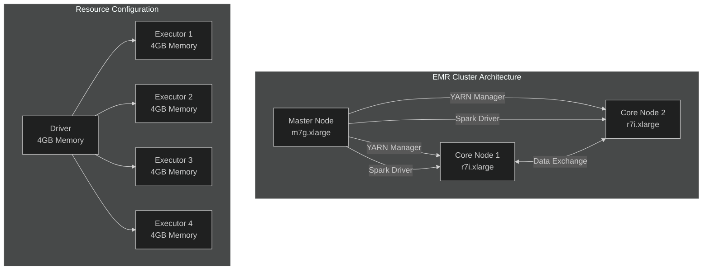
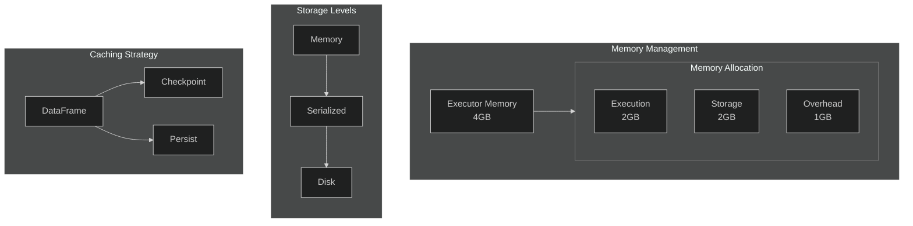
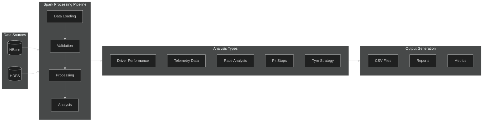

# Spark Configuration and Processing Documentation

## Overview
This documentation details the Spark configuration and processing implementation for Formula 1 data analysis on our EMR cluster. The system is designed to process telemetry, timing, and race data stored in HBase to generate comprehensive race analytics.

## Architecture Overview
The following diagram illustrates our EMR cluster architecture and resource distribution:

## Spark Configuration

### Cluster Mode Configuration
Our Spark configuration is optimized for an EMR cluster running on YARN. The cluster mode settings are designed to maximize resource utilization across our three-node architecture (1 master, 2 core nodes).

### Memory Management
The memory configuration is carefully tuned for our r7i.xlarge instances, as illustrated in the following diagram:

Key configurations:
- Driver Memory: 4GB allocation to handle data aggregation and result collection
- Executor Memory: 4GB per executor to process data chunks efficiently
- Memory Overhead: 1GB buffer to prevent out-of-memory errors
- Storage Fraction: 50% of Spark memory reserved for storage

### Data Processing Pipeline
The following diagram illustrates our complete data processing pipeline:

### Executor Configuration
The executor settings are optimized for our two-node worker configuration:
- Number of Instances: 4 executors distributed across worker nodes
- Cores per Executor: 2 cores to balance parallelism and resource usage
- Dynamic Allocation: Enabled with min=2, max=6 executors

### Network and Storage
Network and storage configurations are optimized for our HBase integration:
- Network Timeout: 800 seconds for long-running queries
- Serializer: KryoSerializer with 1024MB buffer for efficient data serialization
- Storage Level: MEMORY_AND_DISK_SER for optimal performance

## Data Processing Implementation

### Data Collection and Processing

#### Driver Performance Analysis
The driver performance analysis module processes multiple data points:
- Lap time analysis with average, best, and total laps calculation
- Sector-by-sector performance breakdown
- Speed trap analysis for maximum and average speeds

#### Telemetry Processing
The telemetry analysis processes high-frequency car data:
- Speed profiles across different track sections
- DRS activation patterns and effectiveness
- Brake and throttle usage patterns
- Gear change analysis

#### Race Analysis
Comprehensive race data processing includes:
- Position changes throughout races
- Pit stop performance metrics
- Tyre strategy effectiveness
- Race pace consistency

### Processing Architecture

#### Data Flow
1. Initial Data Loading
   - HBase data is loaded through HappyBase connection
   - Data is converted to Spark DataFrames for processing
   - Schema validation and data cleaning is performed

2. Processing Pipeline
   - Parallel processing of different data aspects
   - Aggregation of results across multiple dimensions
   - Results consolidation and storage

3. Output Generation
   - CSV file generation for each analysis type
   - Timestamp-based file organization
   - Structured output directory hierarchy

#### Performance Optimization

1. Data Partitioning
   - Race-based partitioning for efficient processing
   - Driver-based grouping for telemetry analysis
   - Time-window partitioning for high-frequency data

2. Memory Management
   - Efficient DataFrame caching strategy
   - Memory pressure monitoring
   - Garbage collection optimization

3. Query Optimization
   - Predicate pushdown implementation
   - Column pruning for efficient I/O
   - Join optimization for related data

### Monitoring and Logging

#### Logging System
The logging system provides comprehensive monitoring:
- Detailed execution progress tracking
- Error reporting and stack traces
- Performance metrics collection
- Resource utilization monitoring

#### Performance Metrics
Key metrics tracked during processing:
- Processing time per analysis type
- Data volume processed
- Resource utilization patterns
- Error rates and types

## Maintenance and Operations

### Regular Maintenance
Recommended maintenance procedures:
1. Log Rotation
   - Daily log archival
   - Compression of old logs
   - Storage space monitoring

2. Performance Monitoring
   - Regular metric review
   - Resource utilization analysis
   - Processing time trending

3. Data Quality Checks
   - Schema validation
   - Data completeness verification
   - Result consistency checks

### Troubleshooting Guidelines

#### Common Issues
1. Memory Problems
   - Symptoms: Executor failures, out of memory errors
   - Solutions: Memory configuration adjustment, partition size optimization
   - Prevention: Regular monitoring of memory usage patterns

2. Processing Delays
   - Symptoms: Long processing times, task backlog
   - Solutions: Parallelism adjustment, resource allocation optimization
   - Prevention: Performance baseline monitoring

3. Data Quality Issues
   - Symptoms: Unexpected null values, inconsistent results
   - Solutions: Data validation enhancement, error handling improvement
   - Prevention: Regular data quality audits