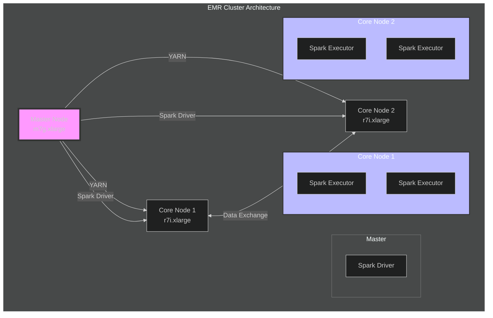
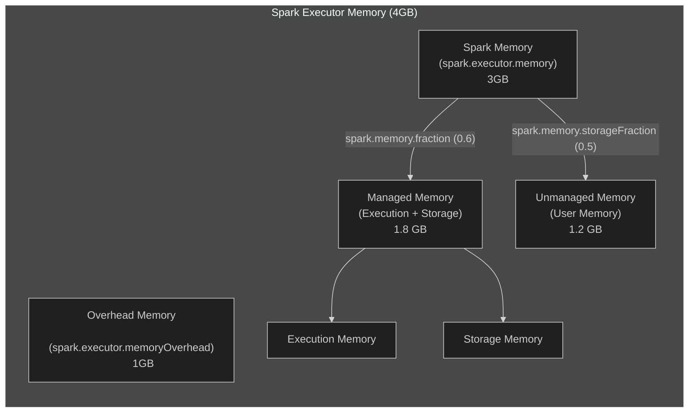
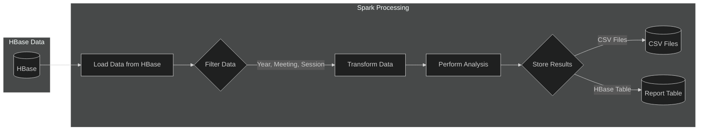
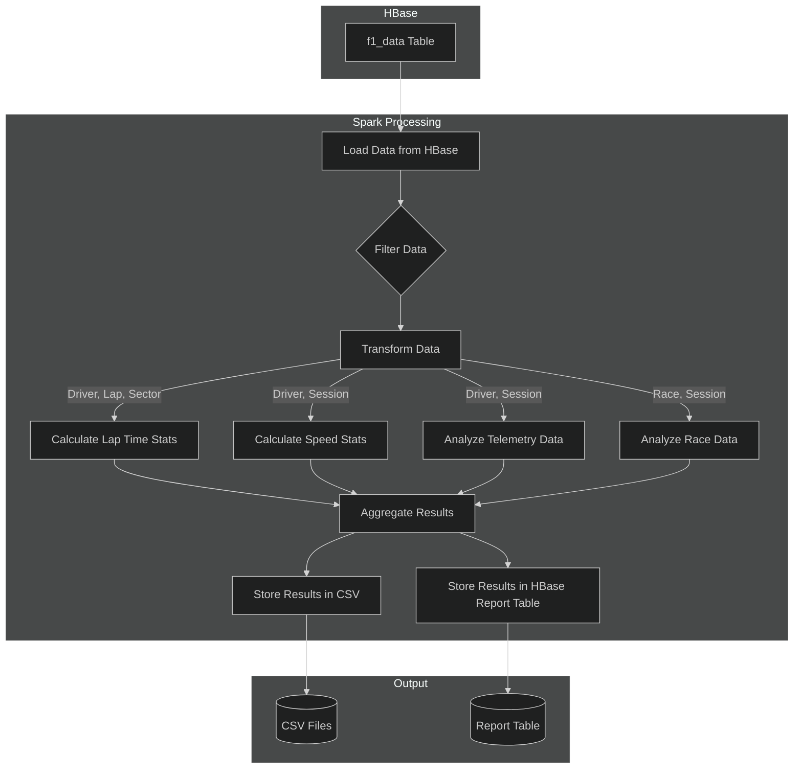

## Spark Configuration for F1 Data Analysis

This document outlines the Apache Spark configuration and processing used for analyzing Formula 1 data on an EMR cluster. Spark is the core engine, enabling efficient analysis of telemetry, timing, and race data from HBase to generate insights on driver and vehicle performance, and race strategy.

**Architecture Overview**

The Spark processing runs on a 3-node EMR cluster (1 master, 2 core) leveraging YARN for resource management and parallel processing.

The **Master Node** orchestrates tasks via the Spark Driver and manages resources with YARN. **Core Nodes** execute tasks using Spark Executors.

**Cluster Resource Distribution:**

| Component          | Description                                                                 |
| ------------------ | --------------------------------------------------------------------------- |
| **Master Node**    | m7g.xlarge, hosts Spark Driver and YARN ResourceManager.                     |
| **Core Nodes (x2)** | r7i.xlarge, each running two Spark Executors for task execution and data storage. |
| **YARN**           | Manages resource allocation and task scheduling across the cluster.          |
| **Spark Driver**   | Coordinates job execution, divides into tasks, and schedules them.        |
| **Spark Executors** | Worker processes executing tasks and storing data partitions.              |

**Resource Allocation:**

-   **Executors per Core Node:** 2
-   **Total Executors:** 4
-   **Cores per Executor:** 2
-   **Memory per Executor:** 4GB

**Spark Configuration**

**Cluster Mode Configuration:** Spark runs in `cluster` mode on YARN.

| Parameter                  | Value                       | Description                                                              |
| -------------------------- | --------------------------- | ------------------------------------------------------------------------ |
| `spark.submit.deployMode`  | `cluster`                   | Spark Driver runs on the cluster (master node).                           |
| `spark.master`             | `yarn`                      | Sets YARN as the resource manager.                                     |
| `spark.yarn.jars`          | `local:/usr/lib/spark/jars/*` | Optimizes job submission by using local Spark JARs on the EMR cluster. |

**Memory Management:** Optimizes memory allocation between execution and storage.

-   **Executor Memory:** 4GB for task execution and data storage.
-   **Overhead Memory:** 1GB for non-heap usage.
-   **Spark Memory Fraction:** 60% of executor memory (excluding overhead) for Spark's managed memory (1.8 GB).
-   **Storage Memory Fraction:** 50% of managed memory for caching (0.9 GB).
-   **Execution Memory:** For shuffles, joins, sorts, aggregations.
-   **Storage Memory:** For caching data.
-   **User Memory:** Remaining memory for user-defined data and objects.

**Executor Configuration:** Optimized for parallel processing.

| Parameter                            | Value            | Rationale                                                                       |
| ------------------------------------ | ---------------- | ------------------------------------------------------------------------------- |
| `spark.executor.instances`           | 4                | Concurrent task execution across the cluster.                                  |
| `spark.executor.cores`               | 2                | Balances parallelism and resource usage per executor.                          |
| `spark.dynamicAllocation.enabled`    | `true`           | Adjusts executor count based on workload.                                      |
| `spark.dynamicAllocation.minExecutors` | 2                | Minimum number of executors.                                                    |
| `spark.dynamicAllocation.maxExecutors` | 6                | Maximum number of executors.                                                    |
| `spark.dynamicAllocation.initialExecutors`| 2                | Initial number of executors.                                                   |
| `spark.dynamicAllocation.executorIdleTimeout`| `60s`            | Timeout for idle executors.                                                 |
| `spark.dynamicAllocation.schedulerBacklogTimeout`| `1s`            | Timeout to request new executors when there's a backlog.                     |
| `spark.dynamicAllocation.sustainedSchedulerBacklogTimeout`| `5s`            | Timeout for sustained backlog before requesting new executors.           |

**Network and Storage:**

| Parameter                     | Value                             | Description                                                                   |
| ----------------------------- | --------------------------------- | ----------------------------------------------------------------------------- |
| `spark.network.timeout`       | `800s`                            | Increased timeout for long-running operations.                                |
| `spark.serializer`            | `org.apache.spark.serializer.KryoSerializer` | Efficient data serialization.                                                |
| `spark.kryoserializer.buffer.max` | `1024m`                           | Maximum buffer size for Kryo serialization.                                   |
| `spark.storage.level`         | `MEMORY_AND_DISK_SER`             | Stores data in memory first, then disk, using serialization for less memory. |

**Other Key Configurations:**

| Parameter                       | Value                                 | Description                                                              |
| ------------------------------- | ------------------------------------- | ------------------------------------------------------------------------ |
| `spark.eventLog.dir`            | `hdfs:///var/log/spark/apps`          | HDFS directory for storing Spark event logs.                             |
| `spark.history.ui.port`         | `18080`                               | Port for the Spark History Server UI.                                     |
| `spark.shuffle.service.port`    | `7337`                                | Port for the external shuffle service.                                    |
| `spark.yarn.scheduler.address`  | `<master-node-private-ip>:8030`       | Address of the YARN ResourceManager.                                      |
| `spark.driver.cores`            | `4`                                   | Cores allocated to the Spark Driver.                                      |

**Data Processing Implementation**

**Data Loading and Preprocessing:**

1. Connect to HBase using `happybase`.
2. Load data from HBase tables into Spark DataFrames using `spark.read.format("org.apache.hadoop.hbase.spark")`.
3. Define DataFrame schemas based on HBase table structure.
4. Filter data based on criteria like year, meeting, session, or driver.
5. Transform raw data: convert timestamps, extract fields, convert binary data, handle missing data.

**Data Processing Pipeline:**

Data is loaded, filtered, transformed, analyzed, and results are stored in CSV files and a report table in HBase.

**Analysis Types:**

-   **Driver Performance Analysis:** Lap times, sector times, speed analysis.
-   **Telemetry Analysis:** Speed profiles, DRS usage, braking/throttle analysis, gear usage.
-   **Race Analysis:** Position changes, pit stop analysis, tyre strategy, race pace.

**Detailed Data Flow for Analysis:**

Data from HBase is loaded, filtered, and transformed. Different analyses are performed, and results are aggregated and stored.

**Performance Optimization:**

| Technique             | Description                                                                  |
| --------------------- | ---------------------------------------------------------------------------- |
| **Data Partitioning** | HBase table design for efficient retrieval; Spark partitioning on relevant columns. |
| **Caching**           | Caching frequently accessed DataFrames in memory (`MEMORY_AND_DISK_SER`).    |
| **Data Serialization** | Using Kryo serialization for efficient data handling.                        |
| **Resource Allocation**| Dynamic allocation; optimized executor memory (4GB) and cores (2).           |
| **Code Optimization**   | Efficient joins, early filtering, column pruning.                             |

**Monitoring and Logging**

**Logging:**

-   **Spark Event Logs:** Stored in HDFS, detailing application execution.
-   **Application Logs:** Console and file logs for progress and errors.
-   **Log Levels:** Control log verbosity.

**Monitoring Tools:**

-   **Spark History Server:** UI for monitoring completed applications.
-   **YARN Resource Manager UI:** Information on cluster resource utilization.
-   **CloudWatch:** Monitors EMR cluster performance.
-   **HBase UI:** Information on HBase cluster status and metrics.

**Maintenance and Operations**

**Regular Maintenance:**

-   Log rotation.
-   Data cleanup.
-   Software updates.
-   Performance monitoring.

**Troubleshooting:**

-   Spark History Server for performance issues.
-   YARN logs for application failures.
-   CloudWatch metrics for resource bottlenecks.
-   HBase logs for data storage issues.

**Conclusion**

The Spark configuration and processing pipeline are designed for efficient analysis of large F1 datasets. Optimizations and configurations are tailored for the specific workload and EMR cluster, ensuring reliable and fast insights into Formula 1 data.
