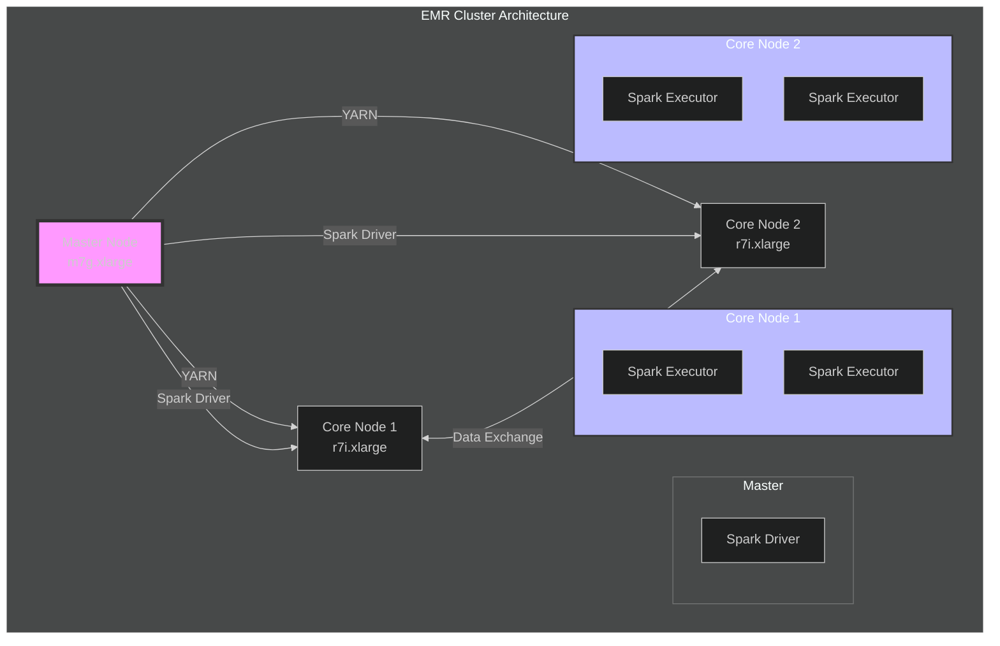
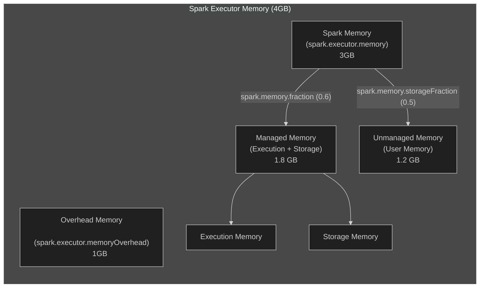
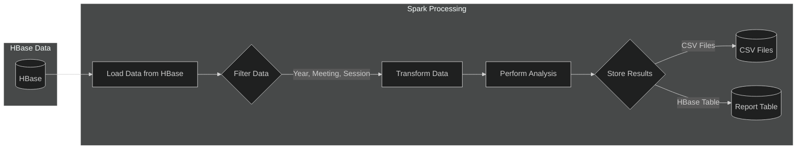
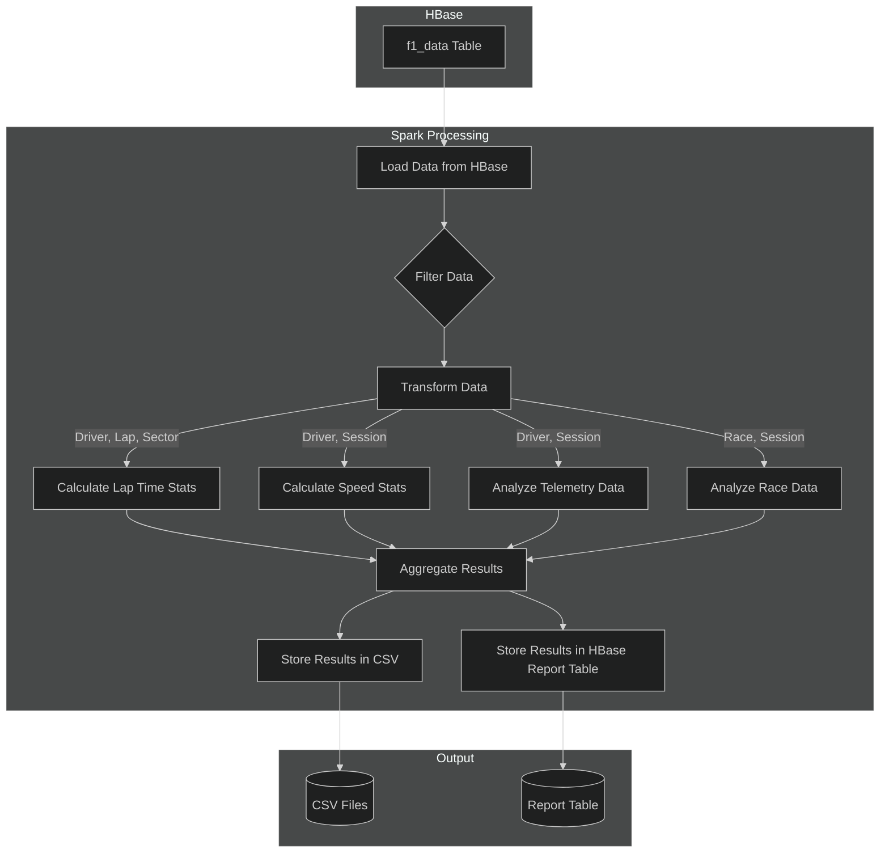

# Spark Configuration and Processing for F1 Data Analysis

## 1. Introduction

This document details the Apache Spark configuration and processing implementation used for Formula 1 data analysis on our EMR cluster. It outlines the architecture, Spark settings, data processing pipeline, and optimization techniques employed to perform comprehensive race analytics. The system is designed to process telemetry data, timing information, and race data stored in HBase, generating valuable insights into driver performance, race strategy, and vehicle performance.

Spark serves as the core processing engine for the F1 data analysis platform, leveraging its distributed computing capabilities to efficiently analyze large datasets. The configuration and processing pipeline are optimized for the specific requirements of F1 data, ensuring fast and reliable analysis.

## 2. Architecture Overview

The Spark processing runs on a 3-node EMR cluster, with one master node coordinating the tasks and two core nodes executing the Spark executors. The architecture is designed to maximize resource utilization and parallel processing capabilities.

### 2.1. Cluster Resource Distribution

**Explanation:**

-   **Master Node (m7g.xlarge)**: Hosts the Spark Driver, which orchestrates the Spark application, and the YARN ResourceManager, which manages cluster resources.
-   **Core Nodes (r7i.xlarge)**: Each core node runs two Spark Executors, responsible for executing tasks and storing data in memory or on disk.
-   **YARN**: YARN (Yet Another Resource Negotiator) manages the allocation of resources to Spark applications and schedules tasks across the cluster.
-   **Spark Driver**: The Spark Driver program runs on the master node, coordinating the execution of Spark jobs, dividing them into tasks, and scheduling them on the executors.
-   **Spark Executors**: Executors are worker processes that run on the core nodes, executing tasks assigned by the driver and storing data partitions.

### 2.2. Resource Allocation

The cluster is configured to utilize the resources of the core nodes effectively:

-   **Executors per Core Node**: 2
-   **Total Executors**: 4 (2 executors x 2 core nodes)
-   **Cores per Executor**: 2
-   **Memory per Executor**: 4GB

This configuration allows for parallel processing of data partitions across the cluster, maximizing throughput and reducing processing time.

## 3. Spark Configuration

### 3.1. Cluster Mode Configuration

The Spark application runs in `cluster` mode on YARN, leveraging the EMR cluster's resources for distributed processing.

**Key Configuration Parameters:**

-   `spark.submit.deployMode`: `cluster` - Specifies that the Spark Driver runs on the cluster (master node) rather than on the client machine.
-   `spark.master`: `yarn` - Sets YARN as the resource manager for Spark.
-   `spark.yarn.jars`: `local:/usr/lib/spark/jars/*` - Specifies the location of Spark JARs on the EMR cluster, optimizing job submission by using local resources.

### 3.2. Memory Management

Memory management is crucial for Spark performance. The configuration is optimized for the `r7i.xlarge` instances, balancing memory allocation between execution and storage.

**Explanation:**

-   **Executor Memory (`spark.executor.memory`)**: 4GB per executor, providing ample space for task execution and data storage.
-   **Overhead Memory (`spark.executor.memoryOverhead`)**: 1GB per executor, reserved for non-heap memory usage, including VM overheads, interned strings, and other native overhead.
-   **Spark Memory Fraction (`spark.memory.fraction`)**: 0.6 (default), meaning 60% of the executor memory (excluding overhead) is used for Spark's managed memory (execution and storage), which is 1.8 GB.
-   **Storage Memory Fraction (`spark.memory.storageFraction`)**: 0.5 (default), meaning 50% of Spark's managed memory is reserved for caching data (0.9 GB after calculation), with the remaining 50% used for execution.
-   **Execution Memory**: Used for operations like shuffles, joins, sorts, and aggregations.
-   **Storage Memory**: Used for caching and persisting data in memory.
-   **User Memory**: The remaining 40% of the executor memory (excluding overhead), managed by the user and used for storing user-defined data structures and any objects created during the execution of user code.

**Rationale:**

-   This memory configuration ensures that executors have sufficient memory for both processing tasks and caching data.
-   The overhead memory prevents out-of-memory errors due to non-heap memory usage.
-   The balance between execution and storage memory allows for efficient data processing while also enabling caching of frequently accessed data.

### 3.3. Executor Configuration

The executor configuration is optimized for parallel processing and resource utilization across the two core nodes.

-   **Number of Executors**: 4 (2 per core node) - This allows for concurrent execution of tasks across the cluster, maximizing parallelism.
-   **Cores per Executor (`spark.executor.cores`)**: 2 - Each executor can run two tasks concurrently, balancing parallelism and resource usage.
-   **Dynamic Allocation (`spark.dynamicAllocation.enabled`)**: `true` - Enables Spark to dynamically adjust the number of executors based on workload demands.
    -   `spark.dynamicAllocation.minExecutors`: 2
    -   `spark.dynamicAllocation.maxExecutors`: 6
    -   `spark.dynamicAllocation.initialExecutors`: 2
    -   `spark.dynamicAllocation.executorIdleTimeout`: 60s
    -   `spark.dynamicAllocation.schedulerBacklogTimeout`: 1s
    -   `spark.dynamicAllocation.sustainedSchedulerBacklogTimeout`: 5s

**Rationale:**

-   Dynamic allocation allows the cluster to efficiently utilize resources by scaling the number of executors up or down based on the workload.
-   The minimum and maximum executor settings provide boundaries for scaling, ensuring that the application has sufficient resources while preventing excessive resource consumption.

### 3.4. Network and Storage

-   **Network Timeout (`spark.network.timeout`)**: `800s` -  Increased timeout to accommodate potentially long-running operations and prevent timeouts during data shuffling or other network-intensive tasks.
-   **Serializer (`spark.serializer`)**: `org.apache.spark.serializer.KryoSerializer` - Uses Kryo serialization for efficient data serialization, improving performance compared to the default Java serializer.
-   **Kryo Buffer Max (`spark.kryoserializer.buffer.max`)**: `1024m` -  Sets the maximum buffer size for Kryo serialization, allowing for serialization of larger objects.
-   **Storage Level (`spark.storage.level`)**: `MEMORY_AND_DISK_SER` -  Specifies that data should be stored in memory when possible, falling back to disk if necessary, and serialized to reduce memory usage.

### 3.5 Other Key Configurations

-   **Event Log Directory (`spark.eventLog.dir`)**: `hdfs:///var/log/spark/apps` - Specifies the HDFS directory for storing Spark event logs, enabling monitoring and debugging of Spark applications.
-   **History Server Address (`spark.history.ui.port`)**: `18080` - Sets the port for the Spark History Server UI, allowing users to view the history of completed Spark applications.
-   **Shuffle Service Port (`spark.shuffle.service.port`)**: `7337` - Defines the port for the external shuffle service.
-   **YARN Scheduler Address (`spark.yarn.scheduler.address`)**: `<master-node-private-ip>:8030` -  Specifies the address of the YARN ResourceManager, enabling Spark to communicate with YARN for resource allocation.
-   **Driver Cores (`spark.driver.cores`)**: `4` -  Allocates 4 cores to the Spark Driver, providing sufficient resources for managing the application and collecting results.

## 4. Data Processing Implementation

The Spark application performs various data processing tasks to generate insights from the Formula 1 data stored in HBase.

### 4.1. Data Loading and Preprocessing

1. **HBase Connection**: The application establishes a connection to HBase using the `happybase` library.
2. **Data Loading**: Data is loaded from HBase tables into Spark DataFrames using the `spark.read.format("org.apache.hadoop.hbase.spark")` API.
3. **Schema Definition**: The schema for each DataFrame is explicitly defined based on the structure of the corresponding HBase table.
4. **Data Filtering**: Data is filtered based on specific criteria, such as year, meeting key, session key, or driver number, to focus on the relevant subset of data for each analysis.
5. **Data Transformation**: Raw data from HBase is transformed into a format suitable for analysis. This includes:
    -   Converting timestamps to appropriate data types.
    -   Extracting relevant fields from composite row keys.
    -   Converting binary data to numerical or string values.
    -   Handling missing or inconsistent data.

### 4.2. Data Processing Pipeline

The data processing pipeline consists of several stages, each performing specific analysis tasks:

**Explanation:**

1. **Load Data from HBase**: Data is loaded from HBase tables into Spark DataFrames.
2. **Filter Data**: Data is filtered based on specific criteria (e.g., year, meeting, session) to focus on the relevant subset for analysis.
3. **Transform Data**: Raw data is transformed into a suitable format for analysis, including data type conversions, composite key parsing, and handling missing values.
4. **Perform Analysis**: Various analytical operations are performed on the transformed data, such as calculating averages, finding maximums, and aggregating data.
5. **Store Results**: The analysis results are stored in two primary formats:
    -   **CSV Files**: Detailed results are written to CSV files for further analysis or reporting.
    -   **Report Table**: Summary statistics and key findings are stored in an HBase table (`f1_reports`) for quick access and monitoring.

### 4.3. Analysis Types

The Spark application performs various types of analyses on the F1 data:

#### 4.3.1. Driver Performance Analysis

-   **Lap Time Analysis**: Calculates average lap times, best lap times, and consistency metrics for each driver.
-   **Sector Time Analysis**: Breaks down lap times into sector times to identify driver strengths and weaknesses on different parts of the track.
-   **Speed Analysis**: Determines top speeds, average speeds, and speed profiles for each driver.

#### 4.3.2. Telemetry Analysis

-   **Speed Profiles**: Analyzes speed data across different track sections and over time.
-   **DRS Usage**: Examines DRS activation patterns, duration, and effectiveness.
-   **Braking and Throttle Analysis**: Studies braking and throttle application patterns to understand driving styles and identify areas for improvement.
-   **Gear Usage**: Analyzes gear change patterns and RPM data.

#### 4.3.3. Race Analysis

-   **Position Changes**: Tracks position changes throughout the race to identify overtaking maneuvers and overall race performance.
-   **Pit Stop Analysis**: Evaluates pit stop times, frequency, and the impact of pit stops on race strategy.
-   **Tyre Strategy**: Analyzes tyre compound usage, stint lengths, and the effectiveness of different tyre strategies.
-   **Race Pace**: Calculates and compares race pace for different drivers and teams.

### 4.4. Detailed Data Flow for Analysis

**Explanation:**

1. **Load Data from HBase**: The Spark application loads data from the `f1_data` table in HBase into DataFrames.
2. **Filter Data**: DataFrames are filtered based on the specific analysis being performed (e.g., by driver, lap, session, or race).
3. **Transform Data**: Data is transformed into the appropriate format for analysis, including data type conversions and handling missing values.
4. **Calculate Lap Time Stats**: Lap time statistics, such as average lap time, best lap time, and sector times, are calculated.
5. **Calculate Speed Stats**: Speed statistics, including top speed, average speed, and speed profiles, are calculated.
6. **Analyze Telemetry Data**: Telemetry data, such as DRS usage, braking and throttle patterns, and gear usage, is analyzed.
7. **Analyze Race Data**: Race data, including position changes, pit stop analysis, and tyre strategy, is analyzed.
8. **Aggregate Results**: Results from the different analyses are aggregated and prepared for storage.
9. **Store Results in CSV**: Detailed analysis results are written to timestamped CSV files in a structured directory.
10. **Store Results in HBase Report Table**: Summary statistics and key findings are stored in the `f1_reports` table in HBase.

### 4.5. Performance Optimization

Several techniques are employed to optimize the performance of the Spark application:

#### 4.5.1. Data Partitioning

-   **HBase Table Design**: The HBase table is designed with row keys that facilitate efficient data retrieval based on common access patterns (year, meeting, session, driver).
-   **Spark Partitioning**: DataFrames are partitioned based on relevant columns (e.g., driver number, session key) to enable parallel processing and improve data locality.

#### 4.5.2. Caching

-   **DataFrame Caching**: Frequently accessed DataFrames are cached in memory using the `persist()` method with the `MEMORY_AND_DISK_SER` storage level. This reduces the need to reload data from HBase for multiple analyses.
-   **Strategic Caching**: Caching is strategically applied to DataFrames that are reused across multiple stages of the analysis pipeline.

#### 4.5.3. Data Serialization

-   **Kryo Serialization**: Kryo serialization is used for efficient serialization of data, improving performance compared to the default Java serializer, especially for shuffle operations.

#### 4.5.4. Resource Allocation

-   **Dynamic Allocation**: Spark's dynamic allocation feature allows the application to adjust the number of executors based on workload demands, optimizing resource utilization.
-   **Executor Memory and Cores**: The configuration of executor memory (4GB) and cores (2) is optimized for the `r7i.xlarge` instance type and the workload characteristics.

#### 4.5.5. Code Optimization

-   **Efficient Joins**: Joins are optimized by using appropriate join types (e.g., broadcast joins for smaller tables) and by ensuring that join keys are properly indexed.
-   **Data Filtering**: Filtering is applied as early as possible in the pipeline to reduce the amount of data processed in subsequent stages.
-   **Column Pruning**: Only necessary columns are selected from DataFrames, reducing the amount of data processed and transferred.

## 5. Monitoring and Logging

### 5.1. Logging

-   **Spark Event Logs**: Spark event logs are enabled and stored in HDFS (`hdfs:///var/log/spark/apps`), providing detailed information about application execution, including task scheduling, resource usage, and performance metrics.
-   **Application Logs**: The Spark application logs informational messages, warnings, and errors to the console and a log file. These logs provide insights into the progress of the analysis, data processing steps, and any issues encountered.
-   **Log Levels**: Log levels are used to control the verbosity of the logs, allowing users to focus on specific types of events (e.g., errors, warnings, or detailed information).

### 5.2. Monitoring Tools

-   **Spark History Server**: The Spark History Server UI (accessible at `http://<master-node-dns>:18080`) provides a visual interface for monitoring completed Spark applications, including their stages, tasks, and resource usage.
-   **YARN Resource Manager UI**: The YARN Resource Manager UI (accessible through the EMR console or directly at the YARN port) provides information about cluster resource utilization, application status, and resource allocation.
-   **CloudWatch**: CloudWatch metrics are used to monitor the performance of the EMR cluster, including CPU utilization, memory usage, network traffic, and disk I/O.
-   **HBase UI**: The HBase UI (accessible at `http://<master-node-dns>:16010`) provides information about the status of the HBase cluster, including region server status, table metrics, and performance data.

## 6. Maintenance and Operations

### 6.1. Regular Maintenance

-   **Log Rotation**: Implement log rotation for Spark event logs and application logs to prevent them from consuming excessive disk space.
-   **Data Cleanup**: Regularly clean up old or unnecessary data from HBase tables and HDFS to optimize storage usage and performance.
-   **Software Updates**: Keep the Spark and Hadoop versions up to date with the latest patches and security updates.
-   **Performance Monitoring**: Regularly monitor the performance of the Spark application and the EMR cluster, adjusting resource allocation and configuration as needed.

### 6.2. Troubleshooting

-   **Spark History Server**: Use the Spark History Server to diagnose performance issues, identify slow tasks, and analyze resource usage for completed applications.
-   **YARN Logs**: Examine YARN logs to troubleshoot application failures, resource allocation problems, and other cluster-level issues.
-   **CloudWatch Metrics**: Monitor CloudWatch metrics to identify resource bottlenecks, such as high CPU utilization, memory pressure, or network congestion.
-   **HBase Logs**: Review HBase logs to diagnose issues with data storage, retrieval, or region server stability.

## 7. Conclusion

This document provides a comprehensive overview of the Spark configuration and processing implementation for the F1 data analysis platform. The choices made in terms of architecture, Spark settings, data processing pipeline, and optimization techniques were driven by the specific requirements of analyzing large-scale Formula 1 data efficiently. By understanding these configurations and the underlying rationale, developers and operators can effectively manage, optimize, and troubleshoot the Spark application, ensuring fast and reliable analysis of F1 data. The detailed diagrams and explanations provide a clear understanding of the system's inner workings, enabling efficient operation and future development.